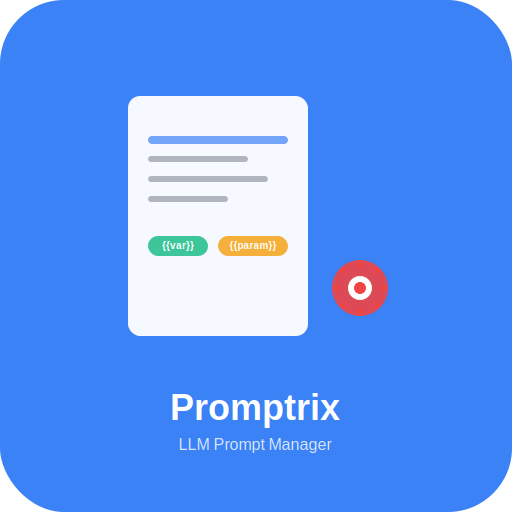

# Promptory

**LLM Prompt 관리 데스크탑 애플리케이션**

Promptory는 LLM(Large Language Model) 프롬프트를 효율적으로 관리하고 사용할 수 있는 크로스 플랫폼 데스크탑 애플리케이션입니다. 직관적인 UI와 강력한 기능으로 프롬프트 작성, 관리, 재사용을 간편하게 만들어줍니다.



## 🚀 주요 기능

### 📝 프롬프트 관리
- **CRUD 기능**: 프롬프트 생성, 읽기, 수정, 삭제
- **메타데이터 관리**: 제목, 설명, 태그, 카테고리
- **마크다운 지원**: 풍부한 텍스트 편집 및 미리보기
- **파일 기반 저장**: 로컬 파일 시스템에 안전하게 저장

### 🔍 검색 및 필터링
- **실시간 검색**: Fuse.js 기반 퍼지 검색
- **태그 필터링**: 태그별 프롬프트 분류
- **카테고리 필터링**: 카테고리별 정리
- **즐겨찾기**: 자주 사용하는 프롬프트 관리
  - 항상 표시되는 즐겨찾기 버튼으로 쉬운 토글
  - 낙관적 UI 업데이트로 즉각적인 피드백
  - 300ms 디바운싱으로 안정적인 동작

### 🎯 파라미터 시스템
- **동적 파라미터**: `{{parameter}}` 형식의 변수 지원
- **타입 지원**: 문자열, 카테고리 등 다양한 타입
- **실시간 미리보기**: 파라미터 입력 시 실시간 결과 확인
- **클립보드 복사**: 완성된 프롬프트 원클릭 복사

### ⌨️ 키보드 단축키
- `Cmd+N` / `Ctrl+N`: 새 프롬프트 생성
- `Cmd+F` / `Ctrl+F`: 검색 포커스
- `Cmd+E` / `Ctrl+E`: 편집 모드 진입
- `Cmd+U` / `Ctrl+U`: 프롬프트 사용 (파라미터 입력)
- `Cmd+D` / `Ctrl+D`: 즐겨찾기 토글
- `Cmd+R` / `Ctrl+R`: 새로고침
- `Cmd+,` / `Ctrl+,`: 설정 창 열기
- `ESC`: 편집 모드 종료 / 모달 닫기

### 📁 파일 감시
- **실시간 동기화**: 파일 시스템 변경 자동 감지
- **외부 편집 지원**: 다른 에디터로 편집한 내용 자동 반영
- **충돌 방지**: 동시 편집 시 안전한 처리

### ⚙️ 설정 관리
- **사용자 설정**: 에디터, 검색, 단축키, 윈도우 설정
- **통합 LLM 설정**: LLM 호출 및 제목 생성을 하나의 탭에서 관리
  - 단일 프로바이더 선택 (OpenAI, Anthropic, Google, OpenRouter)
  - 각 기능별 독립적인 모델 및 타임아웃 설정
  - 인라인 유효성 검사 (1-999초)
- **자동 저장**: 설정 변경사항 자동 저장
- **키보드 단축키 커스터마이징**: 개인 선호에 맞는 단축키 설정
- **에디터 설정**: 워드랩, 라인 번호, 탭 크기, 폰트 설정

### 🎨 사용자 인터페이스
- **모던 디자인**: 깔끔하고 직관적인 인터페이스
- **반응형 레이아웃**: 창 크기에 따른 적응형 UI
- **커스텀 타이틀바**: 네이티브 느낌의 창 제어
- **애니메이션**: 부드러운 화면 전환과 상호작용

## 🛠️ 기술 스택

### Frontend
- **React 18**: 현대적인 UI 라이브러리
- **TypeScript**: 타입 안전성
- **Tailwind CSS**: 유틸리티 기반 스타일링
- **Zustand**: 경량 상태 관리
- **Monaco Editor**: 고급 코드 에디터

### Backend
- **Electron**: 크로스 플랫폼 데스크탑 앱
- **Node.js**: 서버 사이드 로직
- **SQLite**: 로컬 데이터베이스 (캐시)
- **Chokidar**: 파일 시스템 감시

### Build & Deploy
- **Vite**: 빠른 빌드 도구
- **Electron Builder**: 앱 패키징
- **Electron Updater**: 자동 업데이트

### Testing
- **Vitest**: 단위 및 통합 테스트
- **React Testing Library**: React 컴포넌트 테스트
- **Playwright**: E2E 테스트

## 📦 설치 및 실행

### 개발 환경 요구사항
- Node.js 18+
- pnpm (권장) 또는 npm

### 설치
```bash
# 저장소 클론
git clone https://github.com/JeiKeiLim/prompt-organizer.git
cd prompt-organizer

# 의존성 설치
pnpm install

# 개발 서버 실행
pnpm dev
```

### 빌드
```bash
# 프로덕션 빌드
pnpm run build

# 앱 패키징 (현재 플랫폼)
pnpm run pack

# 배포용 빌드 (설치 파일 생성)
pnpm run dist

# 특정 플랫폼 빌드
pnpm run dist:mac    # macOS
pnpm run dist:win    # Windows
pnpm run dist:linux  # Linux
pnpm run dist:all    # 모든 플랫폼
```

## 🧪 테스트

### 테스트 실행
```bash
# 모든 테스트 실행 (자동화)
pnpm test

# 단위 테스트만 실행
pnpm run test:unit

# 통합 테스트만 실행
pnpm run test:integration

# 개발 중 자동 재실행 (Watch 모드)
pnpm run test:watch

# 테스트 UI (시각적 인터페이스)
pnpm run test:ui
```

### 테스트 커버리지
- ✅ **단위 테스트 (20개)**: 핵심 로직 및 유틸리티 함수
  - YAML 파싱, 파라미터 추출, 경로 검증 등
- ✅ **통합 테스트 (55개)**: 실제 사용 시나리오
  - IPC 통신, 파일 시스템, 스토어 통합, UI 워크플로우

### 테스트 결과
```
✅ Test Files  8 passed (8)
✅ Tests  75 passed (75)
✅ Duration  ~2-3s
```

### 테스트 범위
| 영역 | 테스트 수 | 커버리지 |
|------|-----------|----------|
| 유틸리티 (YAML, 파라미터, 경로) | 20 | ✅ 100% |
| 파일 서비스 (CRUD) | 7 | ✅ 핵심 기능 |
| IPC 핸들러 | 7 | ✅ 모든 채널 |
| 스토어 통합 | 18 | ✅ 상태 관리 |
| 파일 시스템 + UI | 8 | ✅ 동기화 |
| 프롬프트 워크플로우 | 15 | ✅ 사용자 시나리오 |

### 테스트 환경
- **프레임워크**: Vitest v2.1.9
- **라이브러리**: React Testing Library
- **환경**: jsdom (브라우저 시뮬레이션)
- **Mock**: Electron API, Window 객체

## 📁 프로젝트 구조

```
prompt-organizer/
├── src/
│   ├── main/           # Electron 메인 프로세스
│   │   ├── handlers/   # IPC 핸들러
│   │   ├── services/   # 백엔드 서비스
│   │   └── utils/      # 유틸리티
│   ├── renderer/       # React 렌더러 프로세스
│   │   ├── components/ # React 컴포넌트
│   │   ├── hooks/      # 커스텀 훅
│   │   ├── stores/     # Zustand 스토어
│   │   └── utils/      # 프론트엔드 유틸리티
│   ├── preload/        # Preload 스크립트
│   └── shared/         # 공유 타입 및 상수
├── tests/              # 테스트 파일
│   ├── unit/          # 단위 테스트
│   ├── integration/   # 통합 테스트
│   └── e2e/           # E2E 테스트
├── build/             # 빌드 리소스
└── release/           # 패키징된 앱
```

## 🎯 사용법

### 1. 프롬프트 생성
1. "새 프롬프트" 버튼 클릭 또는 `Cmd+N`
2. 제목, 설명, 태그 입력
3. 마크다운으로 프롬프트 내용 작성
4. 저장

### 2. 파라미터 사용
```markdown
# 예시 프롬프트
{{role}}로서 {{topic}}에 대해 {{style}} 스타일로 설명해주세요.

세부 요구사항:
- 대상: {{audience}}
- 길이: {{length}}
```

### 3. 프롬프트 사용
1. 프롬프트 선택
2. "사용" 버튼 클릭 또는 `Cmd+U`
3. 파라미터 값 입력
4. "클립보드에 복사" 클릭

## 🔧 설정

### 프로젝트 경로
기본 프로젝트 경로: `~/Promptory`

### 파일 형식
- 프롬프트 파일: `.md` (마크다운)
- 메타데이터: YAML Front Matter
- 인코딩: UTF-8

### 애플리케이션 설정
설정 창(`Cmd+,` 또는 `Ctrl+,`)에서 다음 항목들을 설정할 수 있습니다:

#### 일반 설정
- 언어 설정
- 자동 저장 간격
- 폰트 크기

#### 에디터 설정
- 워드 랩 활성화/비활성화
- 라인 번호 표시
- 탭 크기 (2, 4, 8 스페이스)
- 폰트 패밀리

#### 검색 설정
- 최대 검색 결과 수
- 검색 결과 하이라이트
- 대소문자 구분
- 검색 범위 설정

#### 키보드 단축키
- 모든 단축키 커스터마이징 가능
- 기본값 복원 기능

#### 윈도우 설정
- 창 크기 기억
- 시작 시 최대화

### 예시 프롬프트 파일
```markdown
---
title: "블로그 포스트 생성기"
description: "주제에 맞는 블로그 포스트를 생성합니다"
tags: ["writing", "blog", "content"]
category: "writing"
favorite: false
---

# 블로그 포스트: {{title}}

{{role}}로서 "{{topic}}"에 대한 블로그 포스트를 작성해주세요.

## 요구사항
- 대상 독자: {{audience}}
- 글 길이: {{length}}
- 톤앤매너: {{tone}}

## 구조
1. 흥미로운 도입부
2. 핵심 내용 (3-5개 섹션)
3. 실용적인 팁
4. 마무리 및 행동 유도
```

## 🚀 배포

### 자동 업데이트
- GitHub Releases 기반 자동 업데이트
- 백그라운드 다운로드
- 사용자 승인 후 설치

### 지원 플랫폼
- **macOS**: 10.15+ (Intel, Apple Silicon)
- **Windows**: Windows 10+ (x64, x86)
- **Linux**: Ubuntu 18.04+ (x64)

## 🔄 개발 현황

### ✅ 완료된 기능
- 기본 프롬프트 CRUD 기능
- 실시간 검색 및 필터링
- 파라미터 시스템 및 프롬프트 사용 기능
- 키보드 단축키 시스템
- 파일 감시 및 실시간 동기화
- 설정 관리 시스템
- 커스텀 타이틀바 및 창 제어
- 태그 관리 (더보기/접기 기능)
- 즐겨찾기 시스템
- 토스트 알림 시스템
- 확인 대화상자
- 포괄적인 테스트 스위트

### 🚧 진행 중인 기능
- 프롬프트 템플릿 시스템
- 사용 통계 및 히스토리 추적
- 고급 파라미터 시스템 (조건부, 검증)
- 향상된 검색 기능 (정규식, 고급 필터)

### 📋 계획된 기능
- 프롬프트 가져오기/내보내기
- 클라우드 동기화
- 플러그인 시스템
- 다국어 지원 확장

## 🤝 기여하기

1. Fork the Project
2. Create your Feature Branch (`git checkout -b feature/AmazingFeature`)
3. Commit your Changes (`git commit -m 'Add some AmazingFeature'`)
4. Push to the Branch (`git push origin feature/AmazingFeature`)
5. Open a Pull Request

## 📝 라이선스

MIT License - 자세한 내용은 [LICENSE](LICENSE) 파일을 참조하세요.

## 🙏 감사의 말

- [Electron](https://electronjs.org/) - 크로스 플랫폼 데스크탑 앱 프레임워크
- [React](https://reactjs.org/) - UI 라이브러리
- [Monaco Editor](https://microsoft.github.io/monaco-editor/) - 코드 에디터
- [Tailwind CSS](https://tailwindcss.com/) - CSS 프레임워크
- [Fuse.js](https://fusejs.io/) - 퍼지 검색 라이브러리

## 🐛 알려진 이슈 및 해결책

### 일반적인 문제
1. **앱이 시작되지 않는 경우**
   - Node.js 18+ 버전 확인
   - `pnpm install` 재실행
   - 캐시 삭제: `pnpm store prune`

2. **파일 저장 오류**
   - 프로젝트 폴더 권한 확인
   - 디스크 공간 확인
   - 바이러스 백신 소프트웨어 예외 설정

3. **검색이 느린 경우**
   - 프롬프트 파일 수가 많을 때 발생
   - 설정에서 검색 결과 수 제한 조정

---

**Promptory**로 더 효율적인 LLM 프롬프트 관리를 경험해보세요! 🚀
