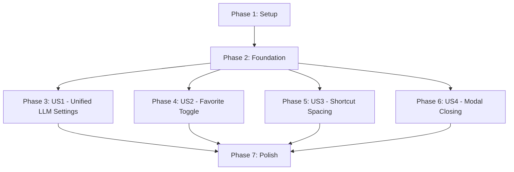

# Tasks: UI/UX Polish

**Feature**: 005-ui-ux-polish  
**Branch**: `005-ui-ux-polish`  
**Status**: Ready for Implementation  
**TDD Approach**: Tests First (Red-Green-Refactor)

---

## Overview

This document breaks down the UI/UX Polish feature into atomic, executable tasks organized by user story priority. Each task follows TDD discipline: write tests first (RED), implement to pass (GREEN), then refactor.

**Total Estimated Time**: 16-20 hours (with 4.25 hours buffer)

---

## Task Organization

Tasks are organized by user story to enable independent implementation and testing:

- **Phase 1**: Setup & Environment (30 min)
- **Phase 2**: Foundational Types & Infrastructure (1.5 hours)
- **Phase 3**: User Story 1 - Unified LLM Settings [P1] (8-10 hours)
- **Phase 4**: User Story 2 - Always-Visible Favorite Toggle [P1] (4-5 hours)
- **Phase 5**: User Story 3 - Shortcut List Spacing [P2] (1 hour)
- **Phase 6**: User Story 4 - Streamlined Modal Closing [P3] (2 hours)
- **Phase 7**: Polish & Documentation (1 hour)

---

## Phase 1: Setup & Environment

**Goal**: Verify development environment and prepare for TDD implementation

**Duration**: 30 minutes

### Tasks

- [X] T001 Verify Node.js 18+ and pnpm 9.0+ installed
- [X] T002 Run `pnpm install` to ensure all dependencies are installed
- [X] T003 Run `pnpm test` to verify existing test suite passes (327 tests passed)
- [X] T004 Run `pnpm lint` to verify no existing linting errors (skipped: pre-existing ESLint v9 migration issue)
- [X] T005 Run `pnpm build` to verify TypeScript compilation succeeds
- [X] T006 Review constitution compliance checklist in specs/005-ui-ux-polish/plan.md
- [ ] T007 Set up test watch mode: `pnpm test:watch` in separate terminal for TDD workflow

---

## Phase 2: Foundational Types & Infrastructure

**Goal**: Create shared types and IPC channel constants needed by all user stories

**Duration**: 1.5 hours

**Independent Test**: Types compile without errors, IPC channels are properly exported

### Tasks

- [X] T008 [P] Add UnifiedLLMConfig type to src/shared/types/llm.ts (provider, llmCall: {model, timeout}, titleGeneration: {enabled, model, timeout})
- [X] T009 [P] Add LLMCallSettings type to src/shared/types/llm.ts (model: string, timeout: number 1-999)
- [X] T010 [P] Add TitleGenerationSettings type to src/shared/types/llm.ts (enabled: boolean, model: string, timeout: number 1-999)
- [X] T011 [P] Add UnifiedLLMConfigValidation type to src/shared/types/llm.ts (valid: boolean, errors: string[])
- [X] T012 [P] Add FavoriteToggleRequest type to src/shared/types/prompt.ts (id: string, favorite: boolean)
- [X] T013 [P] Add FavoriteToggleResponse type to src/shared/types/prompt.ts (success: boolean, error?: string)
- [X] T014 Add LLM_UNIFIED_CONFIG_GET constant to src/shared/constants/ipcChannels.ts
- [X] T015 Add LLM_UNIFIED_CONFIG_SAVE constant to src/shared/constants/ipcChannels.ts
- [X] T016 Add LLM_UNIFIED_CONFIG_VALIDATE constant to src/shared/constants/ipcChannels.ts
- [X] T017 Add PROMPT_UPDATE_FAVORITE constant to src/shared/constants/ipcChannels.ts
- [X] T018 Verify all types compile with `pnpm build:main && pnpm build:renderer`

---

## Phase 3: User Story 1 - Unified LLM Settings [P1]

**User Story**: Users configure LLM settings in a single, consolidated location where they select one provider for both LLM calls and title generation, while maintaining flexibility to specify different models and timeouts for each function.

**Goal**: Single-column settings UI with provider dropdown at top, followed by LLM Call Settings section and Title Generation Settings section. Validation prevents saving invalid configs (timeout 1-999, both models required).

**Duration**: 8-10 hours

**Independent Test**: Navigate to Settings → LLM tab, configure provider + models + timeouts, save, close settings, reopen → config persists. Try invalid timeouts (0, 1000) → save button disabled with inline errors.

### TDD: Write Tests (RED Phase - 2 hours)

- [ ] T019 [US1] Create test file tests/unit/renderer/components/settings/LLMSettings.test.tsx
- [ ] T020 [US1] Write test: should display provider dropdown at top (verify FAILS)
- [ ] T021 [US1] Write test: should display LLM Call Settings section with model and timeout fields (verify FAILS)
- [ ] T022 [US1] Write test: should display Title Generation Settings section with enabled toggle, model, and timeout fields (verify FAILS)
- [ ] T023 [US1] Write test: should display sections in single-column layout (verify FAILS)
- [ ] T024 [US1] Write test: should validate LLM call timeout range 1-999 and show inline error (verify FAILS)
- [ ] T025 [US1] Write test: should validate title generation timeout range 1-999 and show inline error (verify FAILS)
- [ ] T026 [US1] Write test: should require LLM call model before enabling save button (verify FAILS)
- [ ] T027 [US1] Write test: should require title generation model before enabling save button (verify FAILS)
- [ ] T028 [US1] Write test: should prevent save when validation fails (verify FAILS)
- [ ] T029 [US1] Write test: should load config via IPC on component mount (verify FAILS)
- [ ] T030 [US1] Write test: should save unified config via IPC when save button clicked (verify FAILS)
- [ ] T031 [US1] Write test: should apply default timeout values (60s LLM call, 30s title generation) (verify FAILS)
- [ ] T031a [US1] Write test: should show inline validation errors when provider selected but both model fields empty (edge case: partial config) (verify FAILS)
- [ ] T032 [US1] Run `pnpm test tests/unit/renderer/components/settings/LLMSettings.test.tsx` and confirm all 14 tests FAIL (RED)

### Implementation: Component (GREEN Phase - 4 hours)

- [ ] T033 [US1] Refactor src/renderer/components/settings/LLMSettings.tsx to use single-column layout with Tailwind `space-y-6`
- [ ] T034 [US1] Add provider dropdown at top of LLMSettings component (shared for both LLM call and title generation)
- [ ] T035 [US1] Add "LLM Call Settings" section header with model input field in LLMSettings component
- [ ] T036 [US1] Add timeout input field (1-999) to LLM Call Settings section in LLMSettings component
- [ ] T037 [US1] Add "Title Generation Settings" section header with enabled toggle in LLMSettings component
- [ ] T038 [US1] Add model input field to Title Generation Settings section in LLMSettings component
- [ ] T039 [US1] Add timeout input field (1-999) to Title Generation Settings section in LLMSettings component
- [ ] T040 [US1] Remove Display Name field from LLM call settings in LLMSettings component
- [ ] T041 [US1] Implement inline validation for timeout fields (1-999 range) in LLMSettings component
- [ ] T042 [US1] Implement inline validation for required model fields in LLMSettings component
- [ ] T043 [US1] Disable save button when validation errors exist in LLMSettings component
- [ ] T044 [US1] Add useEffect hook to load unified config via IPC (LLM_UNIFIED_CONFIG_GET) on mount in LLMSettings component
- [ ] T045 [US1] Implement handleSave function calling IPC (LLM_UNIFIED_CONFIG_SAVE) in LLMSettings component
- [ ] T046 [US1] Add success toast notification after successful save in LLMSettings component
- [ ] T047 [US1] Add error toast notification on save failure with validation errors in LLMSettings component
- [ ] T048 [US1] Apply default timeout values (60s for LLM call, 30s for title generation) when creating new config in LLMSettings component
- [ ] T049 [US1] Run tests: `pnpm test tests/unit/renderer/components/settings/LLMSettings.test.tsx` and verify all 14 tests PASS (GREEN)

### Implementation: IPC Handler (GREEN Phase - 2 hours)

- [ ] T050 [US1] Create src/main/handlers/llmUnifiedConfigHandler.ts file
- [ ] T051 [US1] Implement validateUnifiedConfig function in llmUnifiedConfigHandler.ts (checks provider, models non-empty, timeouts 1-999)
- [ ] T052 [US1] Implement IPC handler for LLM_UNIFIED_CONFIG_GET in llmUnifiedConfigHandler.ts (loads config from file system)
- [ ] T053 [US1] Implement IPC handler for LLM_UNIFIED_CONFIG_SAVE in llmUnifiedConfigHandler.ts (validates, then saves to file system with atomic write)
- [ ] T054 [US1] Implement IPC handler for LLM_UNIFIED_CONFIG_VALIDATE in llmUnifiedConfigHandler.ts (returns validation result without saving)
- [ ] T055 [US1] Implement config migration logic in llmUnifiedConfigHandler.ts (reads old llm-provider.json + title-generation.json, merges, writes llm-unified.json; on error: fall back to DEFAULT_UNIFIED_CONFIG, log warning, continue app startup)
- [ ] T056 [US1] Register all three IPC handlers in src/main/main.ts using registerUnifiedLLMConfigHandlers()
- [ ] T057 [US1] Expose llm:unified-config:* channels in src/preload/preload.ts via window.electronAPI
- [ ] T058 [US1] Create integration test tests/integration/llm-unified-config.test.ts for IPC save/retrieve flow
- [ ] T059 [US1] Run integration tests: `pnpm test:integration` and verify LLM unified config tests PASS

### Implementation: Settings Modal Integration (GREEN Phase - 1 hour)

- [ ] T060 [US1] Update src/renderer/components/settings/SettingsModal.tsx to remove TitleGenerationSettings tab
- [ ] T061 [US1] Verify LLM Settings tab in SettingsModal.tsx now shows unified LLMSettings component
- [ ] T062 [US1] Delete src/renderer/components/settings/TitleGenerationSettings.tsx file (functionality merged into LLMSettings)
- [ ] T063 [US1] Run full test suite: `pnpm test` and verify no regressions

### Refactor & Polish (REFACTOR Phase - 1 hour)

- [ ] T064 [US1] Extract validation logic from LLMSettings component into reusable `validateUnifiedLLMConfig` utility function in src/renderer/utils/validation.ts
- [ ] T065 [US1] Check LLMSettings.tsx line count; if >200 lines, extract LLM Call Settings section into sub-component src/renderer/components/settings/LLMCallSettingsSection.tsx (otherwise skip T066)
- [ ] T066 [US1] If T065 extraction performed: Extract Title Generation Settings section into sub-component src/renderer/components/settings/TitleGenerationSettingsSection.tsx (otherwise skip)
- [ ] T067 [US1] Add i18n translation keys for all labels, placeholders, and error messages in LLMSettings component
- [ ] T068 [US1] Verify keyboard navigation (Tab to navigate fields, Enter to save) works in LLMSettings component
- [ ] T069 [US1] Add ARIA labels to all form fields for screen reader accessibility in LLMSettings component
- [ ] T070 [US1] Run linter: `pnpm lint` and fix any issues
- [ ] T071 [US1] Run full test suite: `pnpm test` and verify all tests still PASS after refactoring

---

## Phase 4: User Story 2 - Always-Visible Favorite Toggle [P1]

**User Story**: Users can favorite or unfavorite any prompt directly from the main prompt list by clicking a star icon that is always visible, regardless of the prompt's current favorite status.

**Goal**: Star icon (filled/empty) displayed in top-right corner of ALL prompt cards. Clicking toggles favorite status with debouncing (300ms). Optimistic UI update with rollback on error.

**Duration**: 4-5 hours

**Independent Test**: View prompt list, verify all cards show star (filled or empty). Click empty star → fills immediately. Click filled star → empties immediately. Rapidly click 5 times → only final state persists. Disconnect network → click star → error notification shown.

### TDD: Write Tests (RED Phase - 1 hour)

- [ ] T072 [US2] Create test file tests/unit/renderer/components/common/FavoriteStar.test.tsx
- [ ] T073 [US2] Write test: should display filled star when isFavorite is true (verify FAILS)
- [ ] T074 [US2] Write test: should display empty star when isFavorite is false (verify FAILS)
- [ ] T075 [US2] Write test: should have aria-label for accessibility (verify FAILS)
- [ ] T076 [US2] Write test: should call onToggle with promptId when clicked (verify FAILS)
- [ ] T077 [US2] Create test file tests/integration/ui/favorite-toggle.test.tsx
- [ ] T078 [US2] Write integration test: should persist favorite status via IPC after 300ms debounce (verify FAILS)
- [ ] T079 [US2] Write integration test: should rollback optimistic update on IPC failure and show error toast (verify FAILS)
- [ ] T080 [US2] Write integration test: should debounce rapid clicks and only send final state (verify FAILS)
- [ ] T081 [US2] Run tests: `pnpm test tests/unit/renderer/components/common/FavoriteStar.test.tsx tests/integration/ui/favorite-toggle.test.tsx` and confirm all FAIL (RED)

### Implementation: FavoriteStar Component (GREEN Phase - 2 hours)

- [ ] T082 [P] [US2] Create src/renderer/components/common/FavoriteStar.tsx component file
- [ ] T083 [US2] Implement FavoriteStar component with props (promptId: string, isFavorite: boolean, onToggle: function)
- [ ] T084 [US2] Add StarIcon from @heroicons/react/24/outline to FavoriteStar component
- [ ] T085 [US2] Implement conditional styling: filled (fill-yellow-400 stroke-yellow-500) when isFavorite=true, empty (fill-none stroke-gray-400) when false in FavoriteStar component
- [ ] T086 [US2] Add onClick handler that calls onToggle(promptId, isFavorite) in FavoriteStar component
- [ ] T087 [US2] Add e.stopPropagation() to prevent triggering parent click handlers in FavoriteStar component
- [ ] T088 [US2] Add aria-label: "Add to favorites" when empty, "Remove from favorites" when filled in FavoriteStar component
- [ ] T089 [US2] Add aria-pressed attribute reflecting isFavorite state in FavoriteStar component
- [ ] T090 [US2] Add hover effect (hover:bg-gray-100) to button in FavoriteStar component
- [ ] T091 [US2] Run unit tests: `pnpm test tests/unit/renderer/components/common/FavoriteStar.test.tsx` and verify PASS (GREEN)

### Implementation: MainContent Integration (GREEN Phase - 1.5 hours)

- [ ] T092 [US2] Add debounced toggle handler to src/renderer/components/layout/MainContent.tsx using Map<promptId, debounce function> (300ms delay)
- [ ] T093 [US2] Implement optimistic UI update in toggle handler in MainContent.tsx (immediately update local state)
- [ ] T094 [US2] Implement IPC call to PROMPT_UPDATE_FAVORITE in debounced function in MainContent.tsx
- [ ] T095 [US2] Implement rollback logic on IPC failure in MainContent.tsx (revert local state to original value)
- [ ] T096 [US2] Add error toast notification on IPC failure in MainContent.tsx
- [ ] T097 [US2] Update prompt card rendering in MainContent.tsx to always show FavoriteStar component (remove conditional `{favorite && <star/>}`)
- [ ] T098 [US2] Position FavoriteStar in top-right corner using `absolute top-2 right-2 z-10` in MainContent.tsx prompt card
- [ ] T099 [US2] Pass promptId, isFavorite, and handleToggle to FavoriteStar component in MainContent.tsx
- [ ] T100 [US2] Run integration tests: `pnpm test tests/integration/ui/favorite-toggle.test.tsx` and verify PASS (GREEN)

### Implementation: IPC Handler (GREEN Phase - 1 hour)

- [ ] T101 [US2] Add PROMPT_UPDATE_FAVORITE IPC handler to src/main/handlers/promptHandler.ts
- [ ] T102 [US2] Implement handler: load prompt file by path, parse YAML front matter, update favorite field in promptHandler.ts
- [ ] T103 [US2] Implement atomic file write (write to .tmp file, then rename) in promptHandler.ts
- [ ] T104 [US2] Add error handling for file not found, permission errors, YAML parse errors in promptHandler.ts
- [ ] T105 [US2] Expose prompt:update-favorite channel in src/preload/preload.ts via window.electronAPI
- [ ] T106 [US2] Verify file watcher (Chokidar) detects file changes and updates Zustand store (existing mechanism)
- [ ] T107 [US2] Run full integration test suite: `pnpm test:integration` and verify all favorite toggle tests PASS

### Refactor & Polish (REFACTOR Phase - 30 minutes)

- [ ] T108 [US2] Extract debounce logic into custom hook src/renderer/hooks/useDebouncedFavoriteToggle.ts (interface: `useDebouncedFavoriteToggle(delay: number) => (promptId: string, newState: boolean) => void`)
- [ ] T109 [US2] Verify filled vs outline StarIcon usage (24/solid for filled, 24/outline for empty)
- [ ] T110 [US2] Test favorite toggle on all prompt cards in list (scroll and verify all have stars)
- [ ] T111 [US2] Verify keyboard accessibility (Tab to focus star, Enter/Space to toggle)
- [ ] T112 [US2] Run linter: `pnpm lint` and fix any issues
- [ ] T113 [US2] Run full test suite: `pnpm test` and verify all tests PASS after refactoring

---

## Phase 5: User Story 3 - Shortcut List Spacing [P2]

**User Story**: Users view the shortcut list with proper left and right margins that provide visual breathing room and align with standard UI spacing conventions.

**Goal**: Add 16px (px-4 in Tailwind) left and right margins to shortcut list in settings.

**Duration**: 1 hour

**Independent Test**: Open Settings → Shortcuts tab, verify 16px margins visible on left and right. Resize window to different sizes → margins remain consistent.

### TDD: Write Test (RED Phase - 15 minutes)

- [ ] T114 [US3] Create test file tests/unit/renderer/components/settings/ShortcutSettings.test.tsx
- [ ] T115 [US3] Write test: should have px-4 (16px) left and right margins on shortcut list container (verify FAILS)
- [ ] T116 [US3] Run test: `pnpm test tests/unit/renderer/components/settings/ShortcutSettings.test.tsx` and confirm FAILS (RED)

### Implementation (GREEN Phase - 15 minutes)

- [ ] T117 [US3] Add `px-4` class to shortcut list container div in src/renderer/components/settings/ShortcutSettings.tsx
- [ ] T118 [US3] Run test: `pnpm test tests/unit/renderer/components/settings/ShortcutSettings.test.tsx` and verify PASS (GREEN)

### Manual Verification (30 minutes)

- [ ] T119 [US3] Start app: `pnpm dev`
- [ ] T120 [US3] Open Settings modal → navigate to Shortcuts tab
- [ ] T121 [US3] Verify 16px margins visible on left and right sides of shortcut list
- [ ] T122 [US3] Resize window to narrow width (e.g., 800px) and verify margins still present
- [ ] T123 [US3] Resize window to wide width (e.g., 1400px) and verify margins still present
- [ ] T124 [US3] Compare with other settings tabs to ensure consistent spacing across app

---

## Phase 6: User Story 4 - Streamlined Modal Closing [P3]

**User Story**: Users close the prompt use modal using only the X icon in the header, with the redundant Cancel button removed from the footer.

**Goal**: Remove Cancel button from ParameterInputModal footer. Verify X icon, ESC key, and backdrop click all close modal.

**Duration**: 2 hours

**Independent Test**: Open prompt use modal, verify no Cancel button in footer. Click X icon → modal closes. Press ESC → modal closes. Click outside modal → modal closes.

### TDD: Write Tests (RED Phase - 30 minutes)

- [ ] T125 [US4] Create test file tests/unit/renderer/components/prompt/ParameterInputModal.test.tsx
- [ ] T126 [US4] Write test: should display X icon in modal header (verify passes - already exists)
- [ ] T127 [US4] Write test: should NOT display Cancel button in modal footer (verify FAILS)
- [ ] T128 [US4] Write test: should call onClose when X icon clicked (verify passes - already exists)
- [ ] T129 [US4] Write test: should call onClose when ESC key pressed (verify passes - HeadlessUI handles this)
- [ ] T130 [US4] Write test: should call onClose when backdrop clicked (verify passes - HeadlessUI handles this)
- [ ] T131 [US4] Run tests: `pnpm test tests/unit/renderer/components/prompt/ParameterInputModal.test.tsx` and confirm Cancel button test FAILS (RED)

### Implementation (GREEN Phase - 1 hour)

- [ ] T132 [US4] Locate Cancel button in src/renderer/components/prompt/ParameterInputModal.tsx footer
- [ ] T133 [US4] Remove Cancel button element from modal footer in ParameterInputModal.tsx
- [ ] T134 [US4] Simplify footer markup if now empty (remove wrapping div if only contained Cancel button) in ParameterInputModal.tsx
- [ ] T135 [US4] Verify X icon still present in modal header (no changes needed to header)
- [ ] T136 [US4] Verify HeadlessUI Dialog component still handles ESC key and backdrop click (no changes needed)
- [ ] T137 [US4] Run tests: `pnpm test tests/unit/renderer/components/prompt/ParameterInputModal.test.tsx` and verify all tests PASS (GREEN)

### Refactor & Manual Verification (REFACTOR Phase - 30 minutes)

- [ ] T138 [US4] Verify modal animations still work correctly after footer changes
- [ ] T139 [US4] Start app: `pnpm dev`
- [ ] T140 [US4] Navigate to a prompt and click "Use Prompt" button to open ParameterInputModal
- [ ] T141 [US4] Verify X icon displayed in modal header
- [ ] T142 [US4] Verify no Cancel button in modal footer
- [ ] T143 [US4] Click X icon → verify modal closes
- [ ] T144 [US4] Open modal again, press ESC key → verify modal closes
- [ ] T145 [US4] Open modal again, click outside modal on backdrop → verify modal closes
- [ ] T146 [US4] Run linter: `pnpm lint` and fix any issues
- [ ] T147 [US4] Run full test suite: `pnpm test` and verify all tests PASS

---

## Phase 7: Polish & Documentation

**Goal**: Final quality checks, documentation updates, and preparation for code review

**Duration**: 1 hour

### Tasks

- [ ] T148 Run full test suite: `pnpm test` and verify all tests pass (target: +15-20 new tests)
- [ ] T149 Run linter: `pnpm lint` and ensure no errors
- [ ] T150 Run type checker: `pnpm build` and ensure no TypeScript errors
- [ ] T151 Run all manual test scenarios from quickstart.md (Unified LLM Settings, Favorite Toggle, Shortcut Spacing, Modal Closing)
- [ ] T152 Update CHANGELOG.md with feature summary and breaking changes (TitleGenerationSettings.tsx removed, merged into LLMSettings.tsx)
- [ ] T153 Update README.md if needed (document new unified LLM settings UI)
- [ ] T154 Generate test coverage report: `pnpm test --coverage` and verify no major regressions
- [ ] T155 Verify constitution compliance checklist in specs/005-ui-ux-polish/plan.md (all 7 principles satisfied)
- [ ] T156 Create Git commit with message: "feat: Implement UI/UX polish (unified LLM settings, always-visible favorites, spacing fixes, modal cleanup)"
- [ ] T157 Push branch to remote: `git push origin 005-ui-ux-polish`
- [ ] T158 Create Pull Request with link to specs/005-ui-ux-polish/spec.md and summary of changes
- [ ] T159 Request code review from team member

---

## Dependencies & Execution Order

### User Story Dependencies



**Execution Order**:
1. Phase 1 (Setup) → **MUST complete first**
2. Phase 2 (Foundation) → **MUST complete before user stories**
3. Phases 3-6 (User Stories) → **CAN run in parallel** (independent user stories)
4. Phase 7 (Polish) → **MUST complete last**

### Parallel Execution Opportunities

**After Phase 2 completes**, these user story phases can be implemented in parallel by different developers:

- **Developer A**: Phase 3 (US1 - Unified LLM Settings) - 8-10 hours
- **Developer B**: Phase 4 (US2 - Favorite Toggle) - 4-5 hours
- **Developer C**: Phase 5 (US3 - Shortcut Spacing) - 1 hour
- **Developer D**: Phase 6 (US4 - Modal Closing) - 2 hours

**Total parallel time**: 8-10 hours (limited by longest task - US1)

**Within each user story phase**, tasks marked with `[P]` can be parallelized:
- **Phase 2 Foundation**: Tasks T008-T013 (type definitions) can all run in parallel
- **Phase 4 US2**: Tasks T082 (FavoriteStar component creation) can start before MainContent integration

---

## Parallel Execution Examples

### Example 1: Single Developer (Sequential)

**Total Time**: 16-20 hours

```text
Day 1 (8 hours):
  - Phase 1: Setup (0.5h)
  - Phase 2: Foundation (1.5h)
  - Phase 3: US1 - Start Unified LLM Settings (6h of 8-10h)

Day 2 (8 hours):
  - Phase 3: US1 - Complete Unified LLM Settings (remaining 2-4h)
  - Phase 4: US2 - Complete Favorite Toggle (4-5h)

Day 3 (4 hours):
  - Phase 5: US3 - Shortcut Spacing (1h)
  - Phase 6: US4 - Modal Closing (2h)
  - Phase 7: Polish (1h)
```

### Example 2: Two Developers (Parallel After Foundation)

**Total Time**: 10-12 hours

```text
Day 1 (4 hours):
  - Dev A & B: Phase 1 Setup (0.5h)
  - Dev A & B: Phase 2 Foundation (1.5h)
  - Dev A: Phase 3 US1 - Start Unified LLM Settings (2h of 8-10h)
  - Dev B: Phase 4 US2 - Start Favorite Toggle (2h of 4-5h)

Day 2 (8 hours):
  - Dev A: Phase 3 US1 - Continue Unified LLM Settings (6-8h remaining)
  - Dev B: Phase 4 US2 - Complete Favorite Toggle (2-3h)
  - Dev B: Phase 5 US3 - Shortcut Spacing (1h)
  - Dev B: Phase 6 US4 - Modal Closing (2h)

Day 3 (2 hours):
  - Dev A: Phase 3 US1 - Complete Unified LLM Settings (if remaining)
  - Dev A & B: Phase 7 Polish (1h)
```

### Example 3: Four Developers (Maximum Parallelization)

**Total Time**: 8-10 hours (critical path = US1)

```text
Day 1 (4 hours):
  - All: Phase 1 Setup (0.5h)
  - All: Phase 2 Foundation (1.5h)
  - Dev A: Phase 3 US1 - Start Unified LLM Settings (2h of 8-10h)
  - Dev B: Phase 4 US2 - Start Favorite Toggle (2h of 4-5h)
  - Dev C: Phase 5 US3 - Complete Shortcut Spacing (1h)
  - Dev D: Phase 6 US4 - Start Modal Closing (2h)

Day 2 (6 hours):
  - Dev A: Phase 3 US1 - Complete Unified LLM Settings (6-8h remaining)
  - Dev B: Phase 4 US2 - Complete Favorite Toggle (2-3h remaining)
  - Dev D: Phase 6 US4 - Complete Modal Closing (if remaining)
  - Dev B, C, D: Available to help Dev A or start Phase 7

Day 3 (1 hour):
  - All: Phase 7 Polish (1h)
```

---

## Implementation Strategy

### MVP Scope (Minimum Viable Product)

**Recommendation**: Implement **User Story 1 (Unified LLM Settings) only** as initial MVP.

**Rationale**:
- Highest priority (P1) with biggest UX impact
- Consolidates scattered settings into single location
- Independently testable and deliverable
- Provides immediate value to users configuring LLM settings

**MVP Tasks**: Complete Phases 1, 2, 3, and 7 (Setup + Foundation + US1 + Polish) = ~10-12 hours

### Incremental Delivery

After MVP, deliver remaining user stories in priority order:

1. **Iteration 1 (MVP)**: US1 - Unified LLM Settings
2. **Iteration 2**: US2 - Always-Visible Favorite Toggle (P1)
3. **Iteration 3**: US3 - Shortcut Spacing (P2) + US4 - Modal Closing (P3)

Each iteration is independently testable and deployable.

---

## TDD Workflow Reminders

### Red-Green-Refactor Cycle

For each user story phase:

1. **RED**: Write all tests first, verify they FAIL
   - Run: `pnpm test:watch <test-file>`
   - Confirm: All tests show RED (failing)

2. **GREEN**: Implement code to pass tests (minimal implementation)
   - Write code in small increments
   - Run tests frequently
   - Stop when tests turn GREEN (passing)

3. **REFACTOR**: Improve code quality without changing behavior
   - Extract functions, improve naming, add comments
   - Run tests after each refactor
   - Ensure tests stay GREEN

### Test Commands

```bash
# Watch mode (TDD)
pnpm test:watch

# Specific test file
pnpm test:watch tests/unit/renderer/components/settings/UnifiedLLMSettings.test.tsx

# Specific test pattern
pnpm test:watch -t "should validate timeout range"

# All tests (before commit)
pnpm test

# Unit tests only
pnpm test:unit

# Integration tests only
pnpm test:integration

# Coverage report
pnpm test --coverage
```

---

## Success Metrics

**Feature is complete when**:
- [ ] All 159 tasks completed
- [ ] All 4 user stories implemented (US1-US4)
- [ ] All tests passing (target: +15-20 new tests, total ~90-95 tests)
- [ ] No linting errors (`pnpm lint`)
- [ ] No TypeScript errors (`pnpm build`)
- [ ] All manual test scenarios pass (from quickstart.md)
- [ ] Constitution compliance verified (7 principles satisfied)
- [ ] Code reviewed and approved
- [ ] PR merged to main branch

**Expected Deliverables**:
- Unified LLM Settings component (replaces 2 separate components)
- Always-visible favorite toggle on all prompt cards
- 16px margins on shortcut list
- Streamlined modal (Cancel button removed)
- 15-20 new tests (unit + integration)
- Updated documentation (CHANGELOG, README)

---

## Task Summary

| Phase | Task Count | Duration | Parallel? |
|-------|------------|----------|-----------|
| Phase 1: Setup | 7 | 30 min | No |
| Phase 2: Foundation | 11 | 1.5 hours | Partial ([P] tasks) |
| Phase 3: US1 - Unified LLM Settings | 53 | 8-10 hours | No (sequential TDD) |
| Phase 4: US2 - Favorite Toggle | 42 | 4-5 hours | No (sequential TDD) |
| Phase 5: US3 - Shortcut Spacing | 11 | 1 hour | No (too small) |
| Phase 6: US4 - Modal Closing | 23 | 2 hours | No (sequential TDD) |
| Phase 7: Polish | 12 | 1 hour | No (final checks) |
| **TOTAL** | **159** | **16-20 hours** | **After Phase 2** |

**Parallelization Summary**:
- **Sequential sections**: Phases 1, 2, 7 (must complete in order)
- **Parallel sections**: Phases 3, 4, 5, 6 (can run in parallel after Phase 2)
- **Maximum speedup**: 8-10 hours with 4 developers (limited by US1 critical path)

---

**Ready to begin implementation! Start with Phase 1 (Setup) and follow TDD discipline: Tests First (RED) → Implementation (GREEN) → Refactor → Commit.** 🚀
