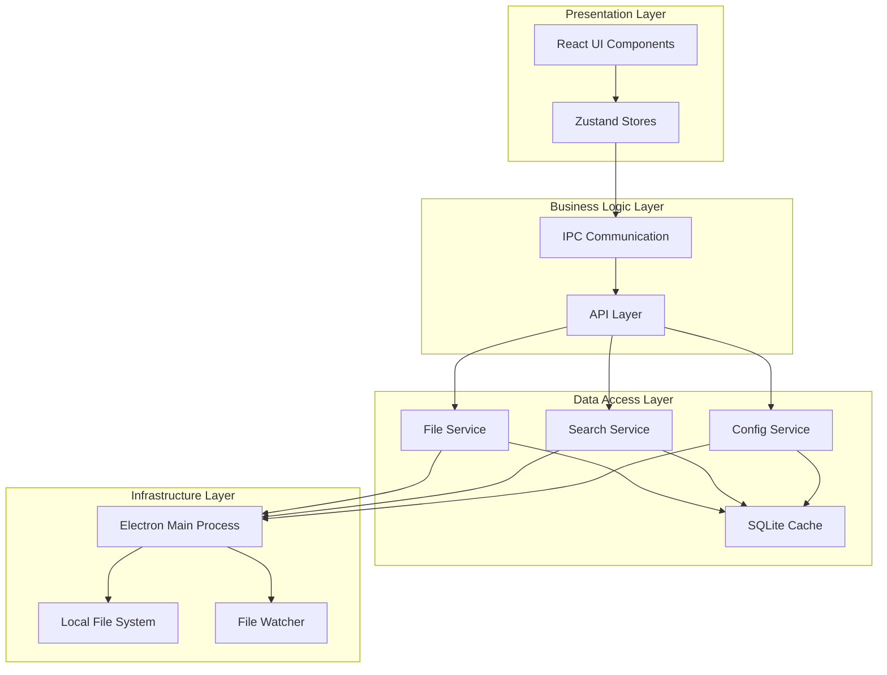
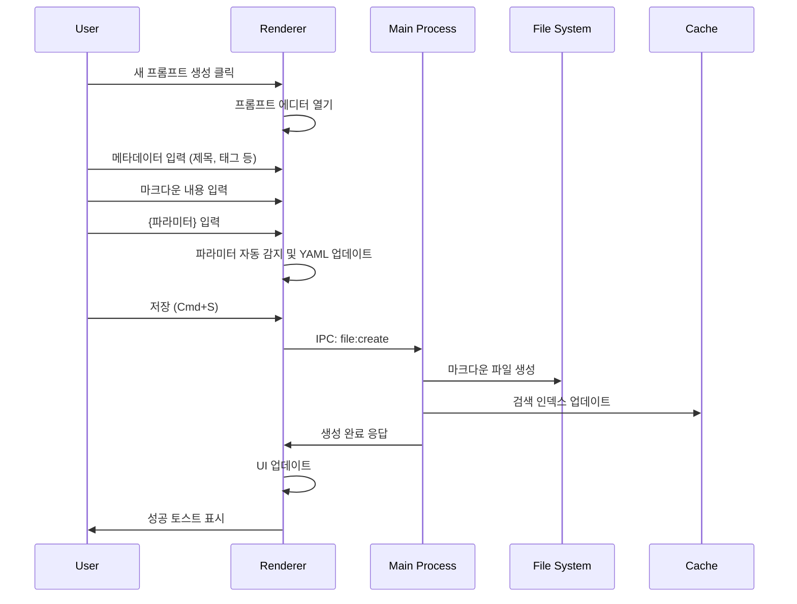
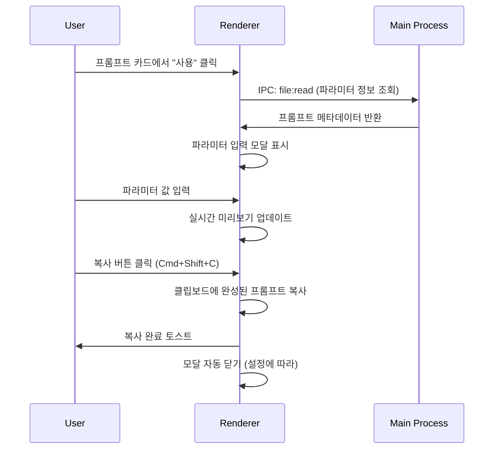
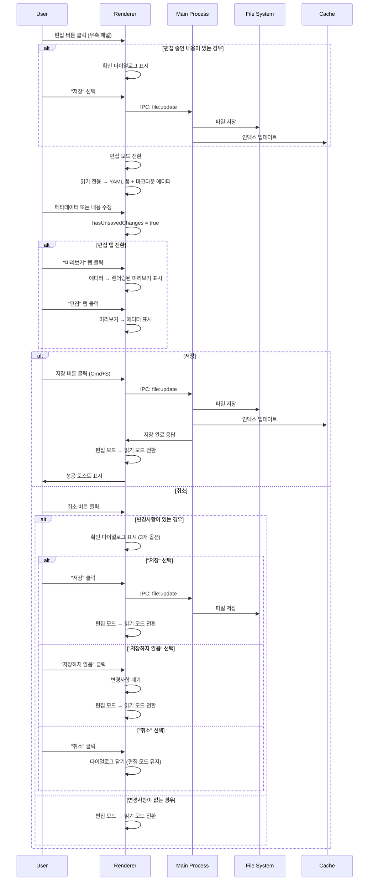
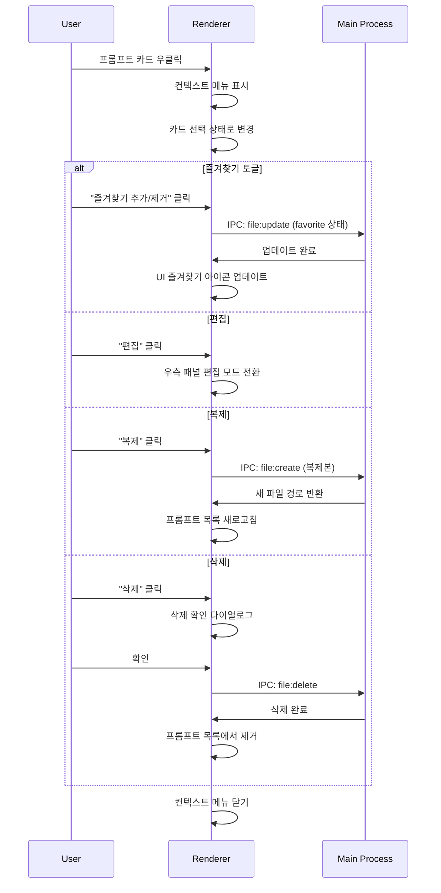
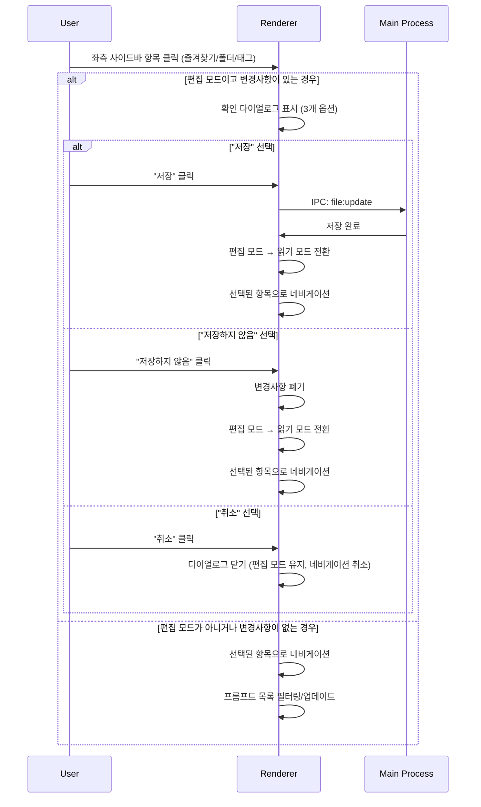
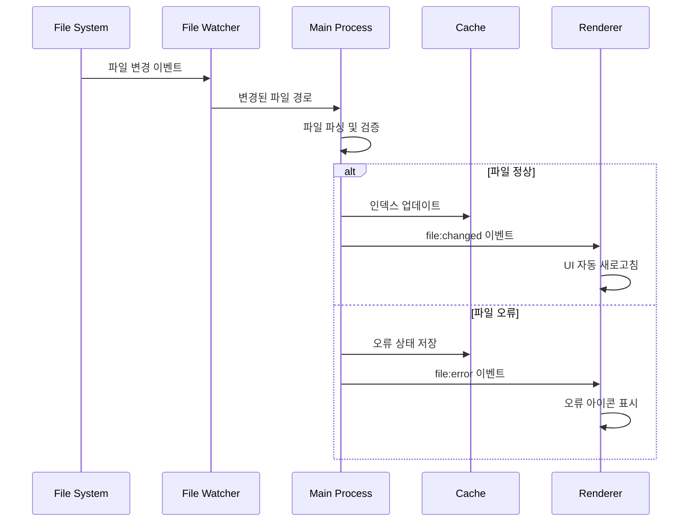
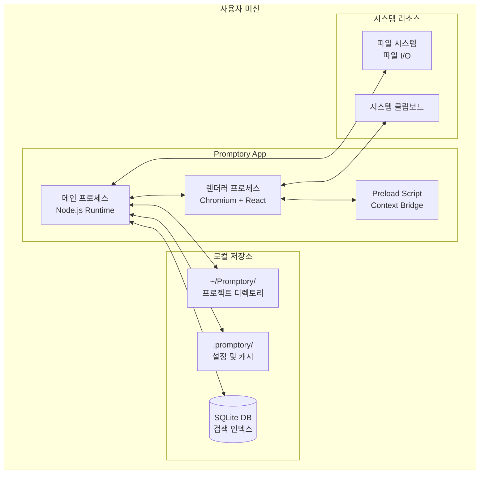
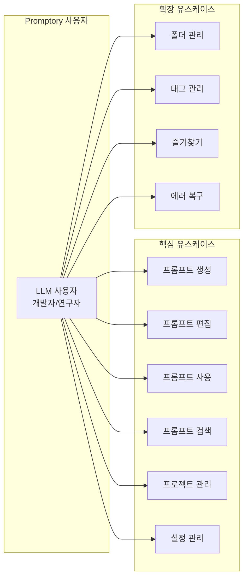

# Promptory 상세 설계서

## 시스템 개요

### 목적 및 비전
Promptory는 LLM 사용자를 위한 효율적인 프롬프트 템플릿 관리 데스크탑 애플리케이션입니다. 파라미터화된 프롬프트를 체계적으로 관리하고, 빠른 검색과 재사용을 통해 LLM 활용 생산성을 극대화하는 것을 목표로 합니다.

### 아키텍처 개요
- **플랫폼**: Electron 32+ 기반 크로스 플랫폼 데스크탑 애플리케이션
- **런타임**: Node.js v24.7.0 LTS
- **프론트엔드**: React 18 + TypeScript 5.6+ + Tailwind CSS
- **상태 관리**: Zustand (기능별 분리된 스토어)
- **데이터 저장**: 로컬 파일 시스템 (마크다운 + YAML)
- **캐싱**: better-sqlite3 (검색 인덱스 및 메타데이터)
- **통신**: Electron IPC (invoke/handle + send/on)
- **빌드 도구**: Vite 6+
- **패키지 매니저**: pnpm

## 컴포넌트 설계

### 메인 프로세스 서비스 아키텍처

```typescript
// 메인 프로세스 서비스 구조
interface MainProcessServices {
  fileService: FileService;
  searchService: SearchService;
  configService: ConfigService;
  projectService: ProjectService;
  cacheService: CacheService;
}

// 각 서비스 인터페이스
interface FileService {
  listFiles(options: FileListOptions): Promise<PromptFileInfo[]>;
  readFile(path: string): Promise<PromptFile>;
  createFile(data: FileCreateData): Promise<string>;
  updateFile(path: string, data: FileUpdateData): Promise<void>;
  deleteFile(path: string, backup: boolean): Promise<void>;
  watchFiles(): void;
}

interface SearchService {
  buildIndex(): Promise<void>;
  search(query: SearchQuery): Promise<SearchResult>;
  rebuildIndex(): Promise<void>;
}

interface ConfigService {
  getConfig(key?: string): Promise<any>;
  setConfig(key: string, value: any): Promise<void>;
  loadConfig(): Promise<AppConfig>;
  saveConfig(config: AppConfig): Promise<void>;
}
```

### 렌더러 프로세스 컴포넌트 구조

```typescript
// 주요 React 컴포넌트 계층구조
interface ComponentHierarchy {
  App: {
    Layout: {
      Sidebar: {
        FavoritesSection: React.FC;
        FolderTreeSection: React.FC;
        TagsSection: React.FC;
      };
      Header: {
        SearchBar: React.FC;
        ActionButtons: React.FC;
      };
      MainContent: {
        PromptCardGrid: React.FC;
        PromptEditor: React.FC;
      };
    };
    Modals: {
      ParameterInputModal: React.FC;
      ErrorModal: React.FC;
      SettingsModal: React.FC;
    };
  };
}
```

## 4+1 View 모델

### 논리 뷰 (Logical View)



### 개발 뷰 (Development View)

#### 프로젝트 디렉토리 구조

```
promptory/
├── src/
│   ├── main/                           # Electron 메인 프로세스
│   │   ├── services/                   # 비즈니스 로직 서비스
│   │   │   ├── FileService.ts
│   │   │   ├── SearchService.ts
│   │   │   ├── ConfigService.ts
│   │   │   ├── ProjectService.ts
│   │   │   └── CacheService.ts
│   │   ├── handlers/                   # IPC 핸들러
│   │   │   ├── fileHandlers.ts
│   │   │   ├── searchHandlers.ts
│   │   │   ├── configHandlers.ts
│   │   │   └── projectHandlers.ts
│   │   ├── utils/                      # 유틸리티 함수
│   │   │   ├── pathUtils.ts
│   │   │   ├── yamlParser.ts
│   │   │   └── fileWatcher.ts
│   │   └── main.ts                     # 메인 프로세스 엔트리
│   ├── renderer/                       # React 렌더러 프로세스
│   │   ├── components/                 # UI 컴포넌트 (기능별 분류)
│   │   │   ├── layout/                 # 레이아웃 컴포넌트
│   │   │   │   ├── Layout.tsx
│   │   │   │   ├── Sidebar.tsx
│   │   │   │   ├── Header.tsx
│   │   │   │   └── MainContent.tsx
│   │   │   ├── prompt/                 # 프롬프트 관련 컴포넌트
│   │   │   │   ├── PromptCard.tsx
│   │   │   │   ├── PromptCardGrid.tsx
│   │   │   │   ├── PromptEditor.tsx
│   │   │   │   └── ParameterForm.tsx
│   │   │   ├── sidebar/                # 사이드바 컴포넌트
│   │   │   │   ├── FavoritesSection.tsx
│   │   │   │   ├── FolderTreeSection.tsx
│   │   │   │   └── TagsSection.tsx
│   │   │   ├── modals/                 # 모달 컴포넌트
│   │   │   │   ├── ParameterInputModal.tsx
│   │   │   │   ├── ErrorModal.tsx
│   │   │   │   └── SettingsModal.tsx
│   │   │   └── common/                 # 공통 컴포넌트
│   │   │       ├── Button.tsx
│   │   │       ├── Input.tsx
│   │   │       ├── Card.tsx
│   │   │       └── Toast.tsx
│   │   ├── stores/                     # Zustand 상태 관리
│   │   │   ├── useAppStore.ts          # 앱 전역 상태
│   │   │   ├── usePromptStore.ts       # 프롬프트 관련 상태
│   │   │   ├── useSearchStore.ts       # 검색 관련 상태
│   │   │   └── useConfigStore.ts       # 설정 관련 상태
│   │   ├── hooks/                      # 커스텀 훅
│   │   │   ├── useIPC.ts               # IPC 통신 훅
│   │   │   ├── useKeyboard.ts          # 키보드 단축키 훅
│   │   │   └── useToast.ts             # 토스트 알림 훅
│   │   ├── utils/                      # 렌더러 유틸리티
│   │   │   ├── formatting.ts          # 텍스트 포맷팅
│   │   │   ├── validation.ts          # 입력 검증
│   │   │   └── constants.ts           # 상수 정의
│   │   ├── styles/                     # 스타일 파일
│   │   │   ├── globals.css            # 전역 스타일
│   │   │   └── components.css         # 컴포넌트별 스타일
│   │   └── App.tsx                     # 렌더러 엔트리
│   ├── shared/                         # 공유 타입 및 인터페이스
│   │   ├── types/                      # TypeScript 타입 정의
│   │   │   ├── prompt.ts               # 프롬프트 관련 타입
│   │   │   ├── ipc.ts                  # IPC 통신 타입
│   │   │   ├── config.ts               # 설정 관련 타입
│   │   │   └── common.ts               # 공통 타입
│   │   └── constants/                  # 공유 상수
│   │       ├── ipcChannels.ts          # IPC 채널 정의
│   │       └── appConstants.ts         # 앱 상수
│   └── preload/                        # Preload 스크립트
│       └── preload.ts                  # Context isolation 설정
├── tests/                              # 테스트 파일
│   ├── unit/                           # 단위 테스트
│   │   ├── services/                   # 서비스 테스트
│   │   ├── components/                 # 컴포넌트 테스트
│   │   └── utils/                      # 유틸리티 테스트
│   ├── integration/                    # 통합 테스트
│   │   ├── ipc/                        # IPC 통신 테스트
│   │   └── filesystem/                 # 파일 시스템 테스트
│   └── fixtures/                       # 테스트 데이터
│       └── sample-prompts/             # 샘플 프롬프트 파일
├── build/                              # 빌드 설정
│   ├── webpack.main.config.js          # 메인 프로세스 웹팩
│   ├── webpack.renderer.config.js      # 렌더러 웹팩
│   └── electron-builder.config.js      # 일렉트론 빌더
├── resources/                          # 정적 리소스
│   ├── icons/                          # 앱 아이콘
│   └── samples/                        # 기본 샘플 프롬프트
├── package.json                        # 프로젝트 설정
├── tsconfig.json                       # TypeScript 설정
├── tailwind.config.js                  # Tailwind CSS 설정
├── vitest.config.ts                    # 테스트 설정
└── README.md                           # 프로젝트 문서
```

#### 주요 기술 스택 및 도구

- **개발 도구**: Vite 6+ (번들러), ESLint + Prettier (코드 품질)
- **패키지 매니저**: pnpm (성능 최적화 및 디스크 효율성)
- **테스트**: Vitest (단위 테스트), React Testing Library (컴포넌트 테스트)
- **스타일**: Tailwind CSS (유틸리티 우선), Headless UI (접근성)
- **상태 관리**: Zustand (경량, 타입 안전)
- **에디터**: Monaco Editor (VS Code 에디터 코어)
- **검색**: Fuse.js (퍼지 검색)
- **파일 감시**: chokidar (크로스 플랫폼 파일 감시)
- **데이터베이스**: better-sqlite3 (고성능 SQLite 드라이버)

### 프로세스 뷰 (Process View)

#### 프롬프트 생성 플로우



#### 프롬프트 사용 플로우



#### 프롬프트 편집 플로우 (업데이트)



#### 컨텍스트 메뉴 플로우



#### 사이드바 네비게이션 플로우



#### 파일 변경 감지 플로우



### 물리 뷰 (Physical View)



### 유스케이스 뷰 (Use Case View)



## 데이터 모델

### better-sqlite3 캐시 스키마

```sql
-- 검색 인덱스 테이블 (better-sqlite3 최적화)
CREATE TABLE search_index (
    id TEXT PRIMARY KEY,
    path TEXT UNIQUE NOT NULL,
    title TEXT NOT NULL,
    description TEXT,
    tags TEXT, -- JSON 배열
    content TEXT, -- 검색용 평문
    favorite INTEGER DEFAULT 0,
    created_at TEXT NOT NULL,
    modified_at TEXT NOT NULL,
    file_size INTEGER,
    parameter_count INTEGER,
    error_status TEXT -- NULL이면 정상
) STRICT;

-- 태그 캐시 테이블 (better-sqlite3 최적화)
CREATE TABLE tags (
    name TEXT PRIMARY KEY,
    count INTEGER DEFAULT 0,
    last_used TEXT
) STRICT;

-- 설정 캐시 테이블 (better-sqlite3 최적화)
CREATE TABLE config (
    key TEXT PRIMARY KEY,
    value TEXT, -- JSON 직렬화된 값
    updated_at TEXT
) STRICT;

-- 인덱스 생성
CREATE INDEX idx_search_title ON search_index(title);
CREATE INDEX idx_search_tags ON search_index(tags);
CREATE INDEX idx_search_favorite ON search_index(favorite);
CREATE INDEX idx_search_modified ON search_index(modified_at);
CREATE INDEX idx_tags_count ON tags(count DESC);
```

### 프롬프트 파일 스키마 (확정)

```markdown
---
title: "프롬프트 제목"
description: "프롬프트 설명 (선택사항)"
tags: ["개발", "코드리뷰"]
favorite: false
created_at: "2024-01-15T09:30:00Z"
parameters:
  - name: "language"
    type: "category"
    required: true
    description: "프로그래밍 언어"
    options: ["Python", "JavaScript", "Java"]
  - name: "focus_area"
    type: "string"
    required: false
    description: "집중할 리뷰 영역"
---

# {language} 코드 리뷰 프롬프트

다음 {language} 코드를 리뷰해주세요.

{focus_area}에 특히 집중하여 검토해주세요.
```

## API 설계

### IPC API 구현 세부사항

```typescript
// 메인 프로세스 - IPC 핸들러 등록
export function registerIpcHandlers() {
  // 파일 관리
  ipcMain.handle('file:list', handleFileList);
  ipcMain.handle('file:read', handleFileRead);
  ipcMain.handle('file:create', handleFileCreate);
  ipcMain.handle('file:update', handleFileUpdate);
  ipcMain.handle('file:delete', handleFileDelete);
  
  // 검색
  ipcMain.handle('search:query', handleSearchQuery);
  ipcMain.handle('search:rebuild-index', handleRebuildIndex);
  
  // 설정
  ipcMain.handle('config:get', handleConfigGet);
  ipcMain.handle('config:set', handleConfigSet);
  
  // 프로젝트
  ipcMain.handle('project:init', handleProjectInit);
  ipcMain.handle('project:switch', handleProjectSwitch);
}

// 렌더러 프로세스 - API 클라이언트
export class PromptoryAPI {
  async listFiles(options: FileListOptions): Promise<PromptFileInfo[]> {
    const response = await window.electronAPI.invoke('file:list', options);
    if (!response.success) throw new Error(response.error.message);
    return response.data;
  }
  
  async searchPrompts(query: SearchRequest): Promise<SearchResult> {
    const response = await window.electronAPI.invoke('search:query', query);
    if (!response.success) throw new Error(response.error.message);
    return response.data;
  }
  
  // ... 기타 API 메서드
}
```

### 검색 엔진 구현

```typescript
// Fuse.js 설정
export class SearchService {
  private fuse: Fuse<SearchIndexItem>;
  
  constructor() {
    this.fuse = new Fuse([], {
      keys: [
        { name: 'title', weight: 0.4 },
        { name: 'tags', weight: 0.3 },
        { name: 'content', weight: 0.3 }
      ],
      threshold: 0.3, // 30% 일치율
      includeScore: true,
      includeMatches: true, // 하이라이트용
      minMatchCharLength: 2
    });
  }
  
  async search(query: SearchRequest): Promise<SearchResult> {
    const startTime = Date.now();
    
    // 스코프 필터링
    const keys = [];
    if (query.scope.title) keys.push('title');
    if (query.scope.tags) keys.push('tags');
    if (query.scope.content) keys.push('content');
    
    this.fuse.setCollection(await this.getIndexData());
    const results = this.fuse.search(query.query, { limit: query.limit || 100 });
    
    return {
      files: results.map(r => this.mapToPromptFileInfo(r)),
      totalCount: results.length,
      query: query.query,
      searchTime: Date.now() - startTime
    };
  }
}
```

## 사용자 인터페이스 설계

### UI 컴포넌트 구조

```typescript
// 메인 레이아웃 컴포넌트
export const Layout: React.FC = () => {
  const [sidebarWidth, setSidebarWidth] = useState(250);
  const [mainContentWidth, setMainContentWidth] = useState(400);
  
  return (
    <div className="flex h-screen bg-gray-50">
      {/* 좌측 사이드바 */}
      <Sidebar width={sidebarWidth} onResize={setSidebarWidth} />
      
      {/* 리사이저 */}
      <Resizer onResize={(delta) => setSidebarWidth(prev => prev + delta)} />
      
      {/* 중앙 프롬프트 목록 */}
      <MainContent width={mainContentWidth} onResize={setMainContentWidth} />
      
      {/* 리사이저 */}
      <Resizer onResize={(delta) => setMainContentWidth(prev => prev + delta)} />
      
      {/* 우측 프롬프트 상세 */}
      <PromptDetail />
    </div>
  );
};

// 사이드바 컴포넌트
export const Sidebar: React.FC<SidebarProps> = ({ width, onResize }) => {
  const { favorites, folders, tags } = usePromptStore();
  const { collapsedSections, toggleSection } = useAppStore();
  
  return (
    <div className="bg-white border-r border-gray-200" style={{ width }}>
      {/* 즐겨찾기 섹션 */}
      <CollapsibleSection
        title="즐겨찾기"
        icon="star"
        collapsed={collapsedSections.favorites}
        onToggle={() => toggleSection('favorites')}
      >
        <FavoritesList items={favorites} />
      </CollapsibleSection>
      
      {/* 폴더 트리 섹션 */}
      <CollapsibleSection
        title="폴더"
        icon="folder"
        collapsed={collapsedSections.folders}
        onToggle={() => toggleSection('folders')}
      >
        <FolderTree folders={folders} />
      </CollapsibleSection>
      
      {/* 태그 섹션 */}
      <CollapsibleSection
        title="태그"
        icon="tag"
        collapsed={collapsedSections.tags}
        onToggle={() => toggleSection('tags')}
      >
        <TagsList tags={tags} />
      </CollapsibleSection>
    </div>
  );
};
```

### 프롬프트 카드 디자인

```typescript
// 프롬프트 카드 컴포넌트
export const PromptCard: React.FC<PromptCardProps> = ({ prompt, onSelect, onUse, onContextMenu }) => {
  const { title, description, tags, favorite, error } = prompt;
  
  const handleContextMenu = (e: React.MouseEvent) => {
    e.preventDefault();
    onContextMenu?.(e, prompt);
  };
  
  return (
    <div 
      className="bg-white rounded-lg border border-gray-200 p-4 hover:shadow-md transition-shadow cursor-pointer"
      onClick={() => onSelect(prompt)}
      onContextMenu={handleContextMenu}
    >
      {/* 헤더 */}
      <div className="flex items-start justify-between mb-2">
        <h3 className="font-medium text-gray-900 truncate flex-1">
          {title}
        </h3>
        <div className="flex items-center gap-1 ml-2">
          {error && (
            <ExclamationTriangleIcon className="w-4 h-4 text-red-500" title="오류 발생" />
          )}
          {favorite && (
            <StarIcon className="w-4 h-4 text-yellow-500" />
          )}
        </div>
      </div>
      
      {/* 설명 */}
      {description && (
        <p className="text-sm text-gray-600 mb-3 line-clamp-2">
          {description}
        </p>
      )}
      
      {/* 태그 */}
      {tags.length > 0 && (
        <div className="flex flex-wrap gap-1 mb-3">
          {tags.slice(0, 3).map(tag => (
            <span key={tag} className="px-2 py-1 bg-blue-100 text-blue-800 text-xs rounded">
              {tag}
            </span>
          ))}
          {tags.length > 3 && (
            <span className="px-2 py-1 bg-gray-100 text-gray-600 text-xs rounded">
              +{tags.length - 3}
            </span>
          )}
        </div>
      )}
      
      {/* 액션 버튼 */}
      <div className="flex justify-end">
        <button
          onClick={(e) => {
            e.stopPropagation();
            onUse(prompt);
          }}
          className="px-3 py-1 bg-blue-600 text-white text-sm rounded hover:bg-blue-700"
        >
          사용
        </button>
      </div>
    </div>
  );
};
```

### 프롬프트 상세 패널 (우측 패널)

```typescript
// 프롬프트 상세 패널 - 읽기/편집 모드 전환
export const PromptDetail: React.FC<PromptDetailProps> = ({ prompt }) => {
  const [isEditing, setIsEditing] = useState(false);
  const [hasUnsavedChanges, setHasUnsavedChanges] = useState(false);
  const [editTab, setEditTab] = useState<'edit' | 'preview'>('edit');
  
  const handleEditMode = () => {
    if (hasUnsavedChanges) {
      // 변경사항 확인 다이얼로그 표시
      showConfirmDialog(
        '변경사항을 저장하시겠습니까?',
        '편집 중인 내용이 있습니다. 저장하지 않고 계속하면 변경사항이 손실됩니다.',
        () => {
          savePrompt();
          setIsEditing(true);
        }
      );
    } else {
      setIsEditing(true);
    }
  };
  
  const handleSave = async () => {
    try {
      await savePrompt();
      setHasUnsavedChanges(false);
      setIsEditing(false);
    } catch (error) {
      console.error('Save failed:', error);
    }
  };
  
  const handleCancel = () => {
    if (hasUnsavedChanges) {
      showConfirmDialog(
        '변경사항을 저장하시겠습니까?',
        '편집 중인 내용이 있습니다. 저장하지 않고 계속하면 변경사항이 손실됩니다.',
        () => {
          savePrompt();
          setIsEditing(false);
          setHasUnsavedChanges(false);
        }
      );
    } else {
      setIsEditing(false);
    }
  };
  
  return (
    <div className="flex flex-col h-full bg-white border-l border-gray-200">
      {/* 헤더 - 제목, 경로, 액션 버튼 */}
      <div className="flex items-center justify-between p-4 border-b border-gray-200">
        <div className="flex-1">
          <h2 className="font-semibold text-gray-900">{prompt.metadata.title}</h2>
          <p className="text-sm text-gray-500">{prompt.path}</p>
        </div>
        
        <div className="flex items-center gap-2">
          {/* 즐겨찾기 버튼 */}
          <button
            onClick={() => toggleFavorite(prompt.id)}
            className="p-1 rounded hover:bg-gray-100"
          >
            <StarIcon 
              className={`w-5 h-5 ${prompt.metadata.favorite ? 'text-yellow-500' : 'text-gray-400'}`}
            />
          </button>
          
          {/* 옵션 메뉴 */}
          <DropdownMenu>
            <DropdownMenu.Trigger>
              <button className="p-1 rounded hover:bg-gray-100">
                <EllipsisVerticalIcon className="w-5 h-5 text-gray-600" />
              </button>
            </DropdownMenu.Trigger>
            <DropdownMenu.Content>
              <DropdownMenu.Item onClick={handleEditMode}>편집</DropdownMenu.Item>
              <DropdownMenu.Item onClick={() => duplicatePrompt(prompt.id)}>복제</DropdownMenu.Item>
              <DropdownMenu.Item 
                className="text-red-600" 
                onClick={() => deletePrompt(prompt.id)}
              >
                삭제
              </DropdownMenu.Item>
            </DropdownMenu.Content>
          </DropdownMenu>
        </div>
      </div>
      
      {/* 읽기 전용 모드 */}
      {!isEditing && (
        <>
          {/* 메타데이터 섹션 */}
          <div className="p-4 border-b border-gray-200">
            <div className="space-y-3">
              {/* 설명 */}
              {prompt.metadata.description && (
                <div>
                  <label className="text-xs font-medium text-gray-500 uppercase tracking-wide">
                    설명
                  </label>
                  <p className="text-sm text-gray-700 mt-1">
                    {prompt.metadata.description}
                  </p>
                </div>
              )}
              
              {/* 태그 */}
              {prompt.metadata.tags.length > 0 && (
                <div>
                  <label className="text-xs font-medium text-gray-500 uppercase tracking-wide">
                    태그
                  </label>
                  <div className="flex flex-wrap gap-1 mt-1">
                    {prompt.metadata.tags.map(tag => (
                      <span 
                        key={tag}
                        className="px-2 py-1 bg-blue-100 text-blue-800 text-xs rounded"
                      >
                        {tag}
                      </span>
                    ))}
                  </div>
                </div>
              )}
              
              {/* 즐겨찾기 상태 */}
              {prompt.metadata.favorite && (
                <div>
                  <label className="text-xs font-medium text-gray-500 uppercase tracking-wide">
                    즐겨찾기
                  </label>
                  <div className="flex items-center gap-2 mt-1">
                    <StarIcon className="w-4 h-4 text-yellow-500" />
                    <span className="text-sm text-gray-700">즐겨찾기</span>
                  </div>
                </div>
              )}
            </div>
          </div>
          
          {/* 렌더링된 마크다운 미리보기 */}
          <div className="flex-1 p-4 overflow-auto">
            <MarkdownRenderer content={prompt.content} />
          </div>
        </>
      )}
      
      {/* 편집 모드 */}
      {isEditing && (
        <>
          {/* YAML 메타데이터 편집 폼 */}
          <div className="p-4 border-b border-gray-200">
            <PromptMetadataForm 
              metadata={prompt.metadata}
              onChange={(metadata) => {
                updatePromptMetadata(prompt.id, metadata);
                setHasUnsavedChanges(true);
              }}
            />
          </div>
          
          {/* 에디터 헤더 - 탭과 액션 버튼 */}
          <div className="flex items-center justify-between p-3 border-b border-gray-200 bg-gray-50">
            <div className="flex">
              <button
                onClick={() => setEditTab('edit')}
                className={`px-3 py-1 text-sm rounded-t ${
                  editTab === 'edit' 
                    ? 'bg-white border border-b-0 text-blue-600' 
                    : 'text-gray-600 hover:text-gray-900'
                }`}
              >
                편집
              </button>
              <button
                onClick={() => setEditTab('preview')}
                className={`px-3 py-1 text-sm rounded-t ${
                  editTab === 'preview' 
                    ? 'bg-white border border-b-0 text-blue-600' 
                    : 'text-gray-600 hover:text-gray-900'
                }`}
              >
                미리보기
              </button>
            </div>
            
            <div className="flex gap-2">
              <button
                onClick={handleCancel}
                className="px-3 py-1 text-sm border border-gray-300 rounded hover:bg-gray-50"
              >
                취소
              </button>
              <button
                onClick={handleSave}
                className="px-3 py-1 text-sm bg-blue-600 text-white rounded hover:bg-blue-700"
              >
                저장
              </button>
            </div>
          </div>
          
          {/* 에디터 내용 */}
          <div className="flex-1 overflow-hidden">
            {editTab === 'edit' ? (
              <MonacoEditor
                value={prompt.content}
                language="markdown"
                onChange={(value) => {
                  updatePromptContent(prompt.id, value);
                  setHasUnsavedChanges(true);
                }}
                options={{
                  wordWrap: 'on',
                  minimap: { enabled: false },
                  scrollBeyondLastLine: false
                }}
              />
            ) : (
              <div className="h-full p-4 overflow-auto bg-gray-50">
                <MarkdownRenderer content={prompt.content} />
              </div>
            )}
          </div>
        </>
      )}
    </div>
  );
};

// 컨텍스트 메뉴 컴포넌트
export const PromptContextMenu: React.FC<ContextMenuProps> = ({ 
  prompt, 
  position, 
  onClose 
}) => {
  return (
    <div 
      className="fixed bg-white border border-gray-200 rounded-lg shadow-lg py-1 z-50"
      style={{ left: position.x, top: position.y }}
    >
      <button
        onClick={() => {
          toggleFavorite(prompt.id);
          onClose();
        }}
        className="w-full px-3 py-2 text-left text-sm hover:bg-gray-100 flex items-center gap-2"
      >
        <StarIcon className="w-4 h-4" />
        {prompt.metadata.favorite ? '즐겨찾기 제거' : '즐겨찾기 추가'}
      </button>
      
      <button
        onClick={() => {
          editPrompt(prompt.id);
          onClose();
        }}
        className="w-full px-3 py-2 text-left text-sm hover:bg-gray-100 flex items-center gap-2"
      >
        <PencilIcon className="w-4 h-4" />
        편집
      </button>
      
      <button
        onClick={() => {
          duplicatePrompt(prompt.id);
          onClose();
        }}
        className="w-full px-3 py-2 text-left text-sm hover:bg-gray-100 flex items-center gap-2"
      >
        <DocumentDuplicateIcon className="w-4 h-4" />
        복제
      </button>
      
      <hr className="my-1 border-gray-200" />
      
      <button
        onClick={() => {
          deletePrompt(prompt.id);
          onClose();
        }}
        className="w-full px-3 py-2 text-left text-sm hover:bg-red-50 text-red-600 flex items-center gap-2"
      >
        <TrashIcon className="w-4 h-4" />
        삭제
      </button>
    </div>
  );
};

// 확인 다이얼로그 컴포넌트 (3개 옵션)
export const ConfirmDialog: React.FC<ConfirmDialogProps> = ({
  title,
  message,
  onSave,
  onDontSave,
  onCancel,
  isOpen
}) => {
  if (!isOpen) return null;
  
  return (
    <div className="fixed inset-0 bg-black bg-opacity-50 flex items-center justify-center z-50">
      <div className="bg-white rounded-lg p-6 max-w-md w-full mx-4">
        <h3 className="text-lg font-semibold text-gray-900 mb-2">{title}</h3>
        <p className="text-gray-600 mb-6">{message}</p>
        
        <div className="flex justify-end gap-3">
          <button
            onClick={onCancel}
            className="px-4 py-2 text-sm border border-gray-300 rounded hover:bg-gray-50"
          >
            취소
          </button>
          <button
            onClick={onDontSave}
            className="px-4 py-2 text-sm border border-gray-300 rounded hover:bg-gray-50"
          >
            저장하지 않음
          </button>
          <button
            onClick={onSave}
            className="px-4 py-2 text-sm bg-blue-600 text-white rounded hover:bg-blue-700"
          >
            저장
          </button>
        </div>
      </div>
    </div>
  );
};

// 에러 상태 프롬프트 상세 패널
export const ErrorPromptDetail: React.FC<ErrorPromptDetailProps> = ({ 
  prompt, 
  errorInfo 
}) => {
  const handleOpenLogFile = () => {
    // IPC를 통해 로그 파일 열기
    window.electronAPI.invoke('system:open-log-file', errorInfo.logPath);
  };
  
  const handleOpenFileLocation = () => {
    // IPC를 통해 파일 위치 열기
    window.electronAPI.invoke('system:show-in-folder', prompt.path);
  };
  
  return (
    <div className="flex flex-col h-full bg-white border-l border-gray-200">
      {/* 헤더 */}
      <div className="flex items-center justify-between p-4 border-b border-gray-200 bg-red-50">
        <div className="flex items-center gap-3">
          <ExclamationTriangleIcon className="w-6 h-6 text-red-500" />
          <div>
            <h2 className="font-semibold text-gray-900">{prompt.metadata?.title || '알 수 없는 파일'}</h2>
            <p className="text-sm text-red-600">파일 오류 발생</p>
          </div>
        </div>
      </div>
      
      {/* 오류 정보 */}
      <div className="p-4 border-b border-gray-200">
        <div className="bg-red-50 border border-red-200 rounded-lg p-4">
          <h3 className="font-medium text-red-800 mb-2">오류</h3>
          <p className="text-sm text-red-700 mb-4">{errorInfo.message}</p>
          
          <div className="flex gap-2">
            <button
              onClick={handleOpenLogFile}
              className="px-3 py-2 bg-red-600 text-white text-sm rounded hover:bg-red-700"
            >
              로그 파일 보기
            </button>
            <button
              onClick={handleOpenFileLocation}
              className="px-3 py-2 border border-red-300 text-red-700 text-sm rounded hover:bg-red-50"
            >
              파일 위치 열기
            </button>
          </div>
        </div>
      </div>
      
      {/* 원본 파일 내용 (Raw) */}
      <div className="flex-1 p-4 overflow-auto">
        <h3 className="font-medium text-gray-900 mb-2">원본 파일 내용</h3>
        <pre className="bg-gray-50 border border-gray-200 rounded p-3 text-sm font-mono overflow-auto">
          {prompt.rawContent || '파일을 읽을 수 없습니다.'}
        </pre>
      </div>
    </div>
  );
};
```

### 파라미터 입력 모달

```typescript
// 파라미터 입력 모달 컴포넌트
export const ParameterInputModal: React.FC<ParameterInputModalProps> = ({ 
  prompt, 
  isOpen, 
  onClose, 
  onCopy 
}) => {
  const [parameters, setParameters] = useState<Record<string, string>>({});
  const [preview, setPreview] = useState('');
  const [autoClose, setAutoClose] = useState(true);
  
  // 실시간 미리보기 업데이트
  useEffect(() => {
    const updatedContent = replaceParameters(prompt.content, parameters);
    setPreview(updatedContent);
  }, [parameters, prompt.content]);
  
  const handleCopy = () => {
    navigator.clipboard.writeText(preview);
    onCopy();
    if (autoClose) {
      onClose();
    }
  };
  
  return (
    <Dialog open={isOpen} onClose={onClose} className="relative z-50">
      <div className="fixed inset-0 bg-black/30" aria-hidden="true" />
      
      <div className="fixed inset-0 flex items-center justify-center p-4">
        <Dialog.Panel className="mx-auto max-w-4xl w-full bg-white rounded-lg shadow-xl">
          <div className="flex h-[600px]">
            {/* 좌측: 파라미터 입력 */}
            <div className="w-1/2 p-6 border-r border-gray-200">
              <Dialog.Title className="text-lg font-medium mb-4">
                파라미터 입력
              </Dialog.Title>
              
              <div className="space-y-4 mb-6">
                {prompt.parameters.map(param => (
                  <div key={param.name}>
                    <label className="block text-sm font-medium text-gray-700 mb-1">
                      {param.name}
                      {param.required && <span className="text-red-500">*</span>}
                    </label>
                    
                    {param.type === 'string' ? (
                      <textarea
                        value={parameters[param.name] || ''}
                        onChange={(e) => setParameters(prev => ({
                          ...prev,
                          [param.name]: e.target.value
                        }))}
                        className="w-full px-3 py-2 border border-gray-300 rounded-md"
                        rows={3}
                        placeholder={param.description}
                      />
                    ) : (
                      <select
                        value={parameters[param.name] || ''}
                        onChange={(e) => setParameters(prev => ({
                          ...prev,
                          [param.name]: e.target.value
                        }))}
                        className="w-full px-3 py-2 border border-gray-300 rounded-md"
                      >
                        <option value="">선택하세요</option>
                        {param.options?.map(option => (
                          <option key={option} value={option}>{option}</option>
                        ))}
                      </select>
                    )}
                    
                    {param.description && (
                      <p className="text-xs text-gray-500 mt-1">{param.description}</p>
                    )}
                  </div>
                ))}
              </div>
              
              {/* 설정 */}
              <div className="border-t pt-4">
                <label className="flex items-center">
                  <input
                    type="checkbox"
                    checked={autoClose}
                    onChange={(e) => setAutoClose(e.target.checked)}
                    className="mr-2"
                  />
                  <span className="text-sm text-gray-600">복사 후 자동으로 닫기</span>
                </label>
              </div>
            </div>
            
            {/* 우측: 미리보기 */}
            <div className="w-1/2 p-6">
              <div className="flex items-center justify-between mb-4">
                <h3 className="text-lg font-medium">미리보기</h3>
                <button
                  onClick={handleCopy}
                  className="px-4 py-2 bg-blue-600 text-white rounded hover:bg-blue-700"
                  disabled={!preview.trim()}
                >
                  복사 (Cmd+Shift+C)
                </button>
              </div>
              
              <div className="bg-gray-50 rounded border p-4 h-full overflow-auto">
                <pre className="whitespace-pre-wrap text-sm">{preview}</pre>
              </div>
            </div>
          </div>
        </Dialog.Panel>
      </div>
    </Dialog>
  );
};
```

## 보안 설계

### Context Isolation 구현

```typescript
// preload.ts - 보안 컨텍스트 브리지
import { contextBridge, ipcRenderer } from 'electron';

// 허용된 IPC 채널
const ALLOWED_CHANNELS = [
  'project:init', 'project:switch',
  'file:list', 'file:read', 'file:create', 'file:update', 'file:delete',
  'folder:create', 'folder:rename', 'folder:delete',
  'search:query', 'search:rebuild-index',
  'tags:list', 'tags:autocomplete',
  'config:get', 'config:set'
];

const ALLOWED_EVENTS = [
  'file:changed', 'file:error'
];

contextBridge.exposeInMainWorld('electronAPI', {
  // IPC 요청-응답
  invoke: (channel: string, ...args: any[]) => {
    if (!ALLOWED_CHANNELS.includes(channel)) {
      throw new Error(`Unauthorized IPC channel: ${channel}`);
    }
    return ipcRenderer.invoke(channel, ...args);
  },
  
  // 이벤트 수신
  on: (channel: string, callback: Function) => {
    if (!ALLOWED_EVENTS.includes(channel)) {
      throw new Error(`Unauthorized event channel: ${channel}`);
    }
    ipcRenderer.on(channel, (_, ...args) => callback(...args));
  },
  
  // 이벤트 수신 해제
  removeListener: (channel: string, callback: Function) => {
    if (!ALLOWED_EVENTS.includes(channel)) return;
    ipcRenderer.removeListener(channel, callback);
  }
});

// 타입 정의
declare global {
  interface Window {
    electronAPI: {
      invoke: (channel: string, ...args: any[]) => Promise<any>;
      on: (channel: string, callback: Function) => void;
      removeListener: (channel: string, callback: Function) => void;
    };
  }
}
```

### 파일 시스템 보안

```typescript
// 경로 검증 유틸리티
export class PathValidator {
  private basePath: string;
  
  constructor(basePath: string) {
    this.basePath = path.resolve(basePath);
  }
  
  validatePath(userPath: string): string {
    const resolvedPath = path.resolve(this.basePath, userPath);
    const normalizedBase = path.normalize(this.basePath);
    
    // 디렉토리 순회 공격 방지
    if (!resolvedPath.startsWith(normalizedBase)) {
      throw new Error('Invalid path: directory traversal detected');
    }
    
    // 시스템 파일 접근 방지
    const forbiddenPaths = ['/etc', '/usr', '/System', 'C:\\Windows'];
    if (forbiddenPaths.some(forbidden => resolvedPath.startsWith(forbidden))) {
      throw new Error('Access to system directories is forbidden');
    }
    
    return resolvedPath;
  }
  
  validateFileName(fileName: string): boolean {
    // 금지된 문자 체크
    const forbiddenChars = /[<>:"/\\|?*\x00-\x1f]/;
    if (forbiddenChars.test(fileName)) {
      return false;
    }
    
    // 예약된 이름 체크 (Windows)
    const reservedNames = /^(CON|PRN|AUX|NUL|COM[1-9]|LPT[1-9])$/i;
    if (reservedNames.test(fileName)) {
      return false;
    }
    
    return true;
  }
}
```

## 에러 처리 설계

### 에러 분류 및 처리 전략

```typescript
// 에러 타입 정의
export enum ErrorType {
  FILE_NOT_FOUND = 'FILE_NOT_FOUND',
  PERMISSION_DENIED = 'PERMISSION_DENIED',
  YAML_PARSE_ERROR = 'YAML_PARSE_ERROR',
  PARAMETER_MISMATCH = 'PARAMETER_MISMATCH',
  DISK_SPACE_FULL = 'DISK_SPACE_FULL',
  INTERNAL_ERROR = 'INTERNAL_ERROR'
}

// 에러 클래스
export class PromptoryError extends Error {
  constructor(
    public type: ErrorType,
    message: string,
    public details?: any
  ) {
    super(message);
    this.name = 'PromptoryError';
  }
}

// 에러 핸들러
export class ErrorHandler {
  static handle(error: Error, context?: string): IpcResponse {
    console.error(`[${context}] Error:`, error);
    
    if (error instanceof PromptoryError) {
      return {
        success: false,
        error: {
          code: error.type,
          message: error.message,
          details: error.details,
          timestamp: new Date().toISOString()
        }
      };
    }
    
    // 예상치 못한 에러
    return {
      success: false,
      error: {
        code: ErrorType.INTERNAL_ERROR,
        message: 'An unexpected error occurred',
        details: { originalMessage: error.message },
        timestamp: new Date().toISOString()
      }
    };
  }
  
  // 사용자 친화적 에러 메시지
  static getUserMessage(errorCode: ErrorType): string {
    const messages = {
      [ErrorType.FILE_NOT_FOUND]: '파일을 찾을 수 없습니다.',
      [ErrorType.PERMISSION_DENIED]: '파일에 접근할 권한이 없습니다.',
      [ErrorType.YAML_PARSE_ERROR]: 'YAML 헤더 형식이 올바르지 않습니다.',
      [ErrorType.PARAMETER_MISMATCH]: '파라미터 설정에 오류가 있습니다.',
      [ErrorType.DISK_SPACE_FULL]: '디스크 공간이 부족합니다.',
      [ErrorType.INTERNAL_ERROR]: '예상치 못한 오류가 발생했습니다.'
    };
    
    return messages[errorCode] || '알 수 없는 오류가 발생했습니다.';
  }
}
```

### Toast 알림 시스템

```typescript
// Toast 상태 관리
export const useToastStore = create<ToastStore>((set, get) => ({
  toasts: [],
  
  addToast: (toast: Omit<Toast, 'id'>) => {
    const id = Date.now().toString();
    const newToast = { ...toast, id };
    
    set(state => ({
      toasts: [...state.toasts, newToast]
    }));
    
    // 자동 제거
    setTimeout(() => {
      get().removeToast(id);
    }, toast.duration || 3000);
  },
  
  removeToast: (id: string) => {
    set(state => ({
      toasts: state.toasts.filter(toast => toast.id !== id)
    }));
  }
}));

// Toast 컴포넌트
export const ToastContainer: React.FC = () => {
  const { toasts } = useToastStore();
  
  return (
    <div className="fixed top-4 right-4 z-50 space-y-2">
      {toasts.map(toast => (
        <div
          key={toast.id}
          className={`px-4 py-3 rounded-lg shadow-lg ${
            toast.type === 'success' ? 'bg-green-500 text-white' :
            toast.type === 'error' ? 'bg-red-500 text-white' :
            toast.type === 'warning' ? 'bg-yellow-500 text-black' :
            'bg-blue-500 text-white'
          }`}
        >
          <div className="flex items-center justify-between">
            <span>{toast.message}</span>
            <button
              onClick={() => useToastStore.getState().removeToast(toast.id)}
              className="ml-3 text-white hover:text-gray-200"
            >
              ×
            </button>
          </div>
        </div>
      ))}
    </div>
  );
};
```

## 상태 관리 설계

### Zustand 스토어 구조

```typescript
// 앱 전역 상태
export const useAppStore = create<AppStore>((set, get) => ({
  // UI 상태
  collapsedSections: {
    favorites: false,
    folders: false,
    tags: false
  },
  
  // 레이아웃 상태
  sidebarWidth: 250,
  mainContentWidth: 400,
  
  // 편집 상태
  editingPromptId: null,
  hasUnsavedChanges: false,
  editTab: 'edit' as 'edit' | 'preview',
  
  // 모달 및 다이얼로그 상태
  contextMenu: {
    isOpen: false,
    position: { x: 0, y: 0 },
    promptId: null
  },
  confirmDialog: {
    isOpen: false,
    title: '',
    message: '',
    onSave: null,
    onDontSave: null
  },
  
  // 설정
  settings: {
    theme: 'system',
    fontSize: 14,
    autoCloseModal: true
  },
  
  // 액션
  toggleSection: (section: string) => {
    set(state => ({
      collapsedSections: {
        ...state.collapsedSections,
        [section]: !state.collapsedSections[section]
      }
    }));
  },
  
  setSidebarWidth: (width: number) => set({ sidebarWidth: width }),
  setMainContentWidth: (width: number) => set({ mainContentWidth: width }),
  
  // 편집 상태 관리
  setEditingPrompt: (promptId: string | null) => set({ editingPromptId: promptId }),
  setUnsavedChanges: (hasChanges: boolean) => set({ hasUnsavedChanges: hasChanges }),
  setEditTab: (tab: 'edit' | 'preview') => set({ editTab: tab }),
  
  // 컨텍스트 메뉴 관리
  showContextMenu: (position: { x: number; y: number }, promptId: string) => {
    set({
      contextMenu: {
        isOpen: true,
        position,
        promptId
      }
    });
  },
  hideContextMenu: () => {
    set({
      contextMenu: {
        isOpen: false,
        position: { x: 0, y: 0 },
        promptId: null
      }
    });
  },
  
  // 확인 다이얼로그 관리 (3개 옵션)
  showConfirmDialog: (
    title: string, 
    message: string, 
    onSave: () => void, 
    onDontSave: () => void
  ) => {
    set({
      confirmDialog: {
        isOpen: true,
        title,
        message,
        onSave,
        onDontSave
      }
    });
  },
  hideConfirmDialog: () => {
    set({
      confirmDialog: {
        isOpen: false,
        title: '',
        message: '',
        onSave: null,
        onDontSave: null
      }
    });
  },
  
  updateSettings: (settings: Partial<AppSettings>) => {
    set(state => ({
      settings: { ...state.settings, ...settings }
    }));
  }
}));

// 프롬프트 관련 상태
export const usePromptStore = create<PromptStore>((set, get) => ({
  // 데이터
  prompts: [],
  selectedPrompt: null,
  folders: [],
  favorites: [],
  
  // UI 상태
  sortBy: 'modified',
  sortOrder: 'desc',
  
  // 액션
  setPrompts: (prompts: PromptFileInfo[]) => set({ prompts }),
  selectPrompt: (prompt: PromptFileInfo | null) => set({ selectedPrompt: prompt }),
  updatePrompt: (id: string, updates: Partial<PromptFileInfo>) => {
    set(state => ({
      prompts: state.prompts.map(p => 
        p.id === id ? { ...p, ...updates } : p
      )
    }));
  },
  
  setSortOptions: (sortBy: SortBy, sortOrder: SortOrder) => {
    set({ sortBy, sortOrder });
  }
}));

// 검색 관련 상태
export const useSearchStore = create<SearchStore>((set, get) => ({
  // 검색 상태
  query: '',
  results: [],
  isSearching: false,
  searchScope: {
    title: true,
    tags: true,
    content: true
  },
  
  // 액션
  setQuery: (query: string) => set({ query }),
  setResults: (results: PromptFileInfo[]) => set({ results }),
  setSearching: (isSearching: boolean) => set({ isSearching }),
  updateSearchScope: (scope: Partial<SearchScope>) => {
    set(state => ({
      searchScope: { ...state.searchScope, ...scope }
    }));
  }
}));
```

### 영속화 설정

```typescript
// localStorage 영속화 설정
export const useAppStore = create<AppStore>()(
  persist(
    (set, get) => ({
      // ... 스토어 구현
    }),
    {
      name: 'promptory-app-store',
      partialize: (state) => ({
        collapsedSections: state.collapsedSections,
        sidebarWidth: state.sidebarWidth,
        mainContentWidth: state.mainContentWidth,
        settings: state.settings
      })
    }
  )
);

export const usePromptStore = create<PromptStore>()(
  persist(
    (set, get) => ({
      // ... 스토어 구현
    }),
    {
      name: 'promptory-prompt-store',
      partialize: (state) => ({
        sortBy: state.sortBy,
        sortOrder: state.sortOrder
      })
    }
  )
);
```

## 성능 최적화 설계

### 가상화 및 지연 로딩

```typescript
// 가상화된 프롬프트 목록
export const VirtualizedPromptGrid: React.FC<VirtualizedPromptGridProps> = ({ 
  prompts, 
  onSelectPrompt 
}) => {
  const parentRef = useRef<HTMLDivElement>(null);
  
  const rowVirtualizer = useVirtualizer({
    count: Math.ceil(prompts.length / CARDS_PER_ROW),
    getScrollElement: () => parentRef.current,
    estimateSize: () => CARD_HEIGHT + GAP,
    overscan: 5
  });
  
  return (
    <div ref={parentRef} className="h-full overflow-auto">
      <div
        style={{
          height: `${rowVirtualizer.getTotalSize()}px`,
          width: '100%',
          position: 'relative'
        }}
      >
        {rowVirtualizer.getVirtualItems().map(virtualRow => {
          const startIndex = virtualRow.index * CARDS_PER_ROW;
          const endIndex = Math.min(startIndex + CARDS_PER_ROW, prompts.length);
          const rowPrompts = prompts.slice(startIndex, endIndex);
          
          return (
            <div
              key={virtualRow.index}
              style={{
                position: 'absolute',
                top: 0,
                left: 0,
                width: '100%',
                height: `${virtualRow.size}px`,
                transform: `translateY(${virtualRow.start}px)`
              }}
            >
              <div className="flex gap-4 p-4">
                {rowPrompts.map(prompt => (
                  <PromptCard
                    key={prompt.id}
                    prompt={prompt}
                    onSelect={onSelectPrompt}
                  />
                ))}
              </div>
            </div>
          );
        })}
      </div>
    </div>
  );
};
```

### 검색 디바운싱

```typescript
// 검색 디바운싱 훅
export const useSearchDebounce = (delay: number = 300) => {
  const [debouncedQuery, setDebouncedQuery] = useState('');
  const { query, setResults, setSearching } = useSearchStore();
  
  useEffect(() => {
    setSearching(true);
    
    const timer = setTimeout(async () => {
      if (query.trim()) {
        try {
          const results = await promptoryAPI.searchPrompts({
            query: query.trim(),
            scope: useSearchStore.getState().searchScope
          });
          setResults(results.files);
        } catch (error) {
          console.error('Search failed:', error);
          setResults([]);
        }
      } else {
        setResults([]);
      }
      setSearching(false);
    }, delay);
    
    return () => {
      clearTimeout(timer);
      setSearching(false);
    };
  }, [query, delay]);
  
  return debouncedQuery;
};
```

## 테스트 전략

### 단위 테스트 구조

```typescript
// 서비스 테스트 예시
describe('FileService', () => {
  let fileService: FileService;
  let mockFs: MockFileSystem;
  
  beforeEach(() => {
    mockFs = new MockFileSystem();
    fileService = new FileService(mockFs);
  });
  
  describe('createFile', () => {
    it('should create a new prompt file with valid metadata', async () => {
      const metadata: PromptMetadata = {
        title: 'Test Prompt',
        description: 'A test prompt',
        tags: ['test'],
        favorite: false,
        created_at: new Date().toISOString(),
        parameters: []
      };
      
      const result = await fileService.createFile({
        folderPath: 'test-folder',
        metadata,
        content: 'Test content'
      });
      
      expect(result).toMatch(/test-folder\/test-prompt\.md$/);
      expect(mockFs.readFile(result)).toContain('title: "Test Prompt"');
    });
    
    it('should throw error for invalid file name', async () => {
      const metadata: PromptMetadata = {
        title: 'Invalid<>Name',
        // ... 기타 필드
      };
      
      await expect(fileService.createFile({
        metadata,
        content: 'Test'
      })).rejects.toThrow('Invalid file name');
    });
  });
});

// IPC 통신 테스트
describe('IPC Communication', () => {
  let mockIpcRenderer: MockIpcRenderer;
  let api: PromptoryAPI;
  
  beforeEach(() => {
    mockIpcRenderer = new MockIpcRenderer();
    api = new PromptoryAPI(mockIpcRenderer);
  });
  
  it('should handle successful file list request', async () => {
    const mockResponse = {
      success: true,
      data: [{ id: '1', title: 'Test', /* ... */ }]
    };
    
    mockIpcRenderer.mockResponse('file:list', mockResponse);
    
    const result = await api.listFiles({ includeContent: false });
    
    expect(result).toEqual(mockResponse.data);
    expect(mockIpcRenderer.invoke).toHaveBeenCalledWith('file:list', { includeContent: false });
  });
});

// React 컴포넌트 테스트
describe('PromptCard', () => {
  const mockPrompt: PromptFileInfo = {
    id: '1',
    path: 'test.md',
    metadata: {
      title: 'Test Prompt',
      description: 'Test description',
      tags: ['test', 'example'],
      favorite: false,
      created_at: '2024-01-01T00:00:00Z',
      parameters: []
    },
    modifiedAt: '2024-01-01T00:00:00Z',
    fileSize: 1024
  };
  
  it('should render prompt information correctly', () => {
    const onSelect = vi.fn();
    const onUse = vi.fn();
    
    render(<PromptCard prompt={mockPrompt} onSelect={onSelect} onUse={onUse} />);
    
    expect(screen.getByText('Test Prompt')).toBeInTheDocument();
    expect(screen.getByText('Test description')).toBeInTheDocument();
    expect(screen.getByText('test')).toBeInTheDocument();
    expect(screen.getByText('example')).toBeInTheDocument();
  });
  
  it('should call onUse when use button is clicked', () => {
    const onSelect = vi.fn();
    const onUse = vi.fn();
    
    render(<PromptCard prompt={mockPrompt} onSelect={onSelect} onUse={onUse} />);
    
    fireEvent.click(screen.getByText('사용'));
    
    expect(onUse).toHaveBeenCalledWith(mockPrompt);
  });
});
```

### 통합 테스트

```typescript
// 파일 시스템 통합 테스트
describe('File System Integration', () => {
  let tempDir: string;
  let fileService: FileService;
  
  beforeAll(async () => {
    tempDir = await fs.mkdtemp(path.join(os.tmpdir(), 'promptory-test-'));
    fileService = new FileService(tempDir);
  });
  
  afterAll(async () => {
    await fs.rm(tempDir, { recursive: true, force: true });
  });
  
  it('should handle complete file lifecycle', async () => {
    // 파일 생성
    const filePath = await fileService.createFile({
      metadata: {
        title: 'Integration Test',
        tags: ['integration'],
        favorite: false,
        created_at: new Date().toISOString(),
        parameters: []
      },
      content: 'Test content'
    });
    
    // 파일 읽기
    const file = await fileService.readFile(filePath);
    expect(file.metadata.title).toBe('Integration Test');
    
    // 파일 수정
    await fileService.updateFile(filePath, {
      metadata: { ...file.metadata, favorite: true },
      content: 'Updated content'
    });
    
    const updatedFile = await fileService.readFile(filePath);
    expect(updatedFile.metadata.favorite).toBe(true);
    
    // 파일 삭제
    await fileService.deleteFile(filePath, false);
    
    await expect(fileService.readFile(filePath)).rejects.toThrow();
  });
});
```